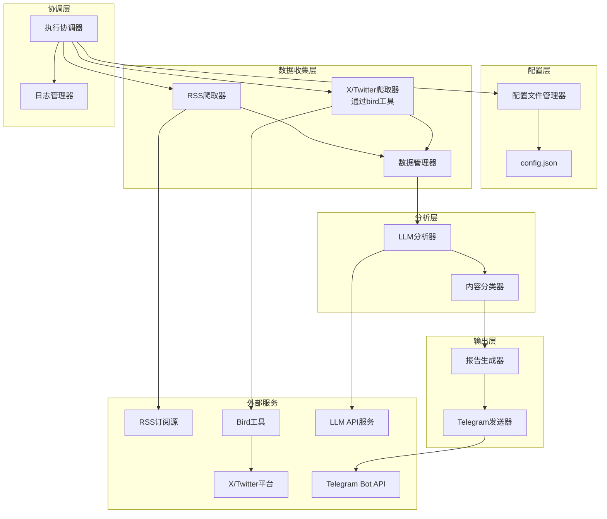

# 设计文档

## 概述

加密货币新闻爬取和分析工具是一个基于Python的自动化系统，采用模块化架构设计。系统通过配置文件管理多个信息源，定时爬取RSS订阅和X/Twitter内容（通过bird工具），使用大语言模型进行智能分析和分类，最终生成结构化报告并通过Telegram Bot自动发送。

### 核心功能
- 配置文件驱动的信息源管理
- 多源数据爬取（RSS + X/Twitter通过bird工具）
- LLM驱动的内容分析和分类
- **可配置的分类标准和识别规则**
- 定时任务调度
- Telegram自动报告发送
- 云服务器部署支持

### 最新变更
本设计文档已更新以反映需求文档的重要变更：
- **需求2 - 配置文件管理**: 扩展为管理信息源和分析规则，包含分类类别定义和识别规则
- **需求4 - X/Twitter内容爬取**: 从直接API调用改为通过bird工具实现，避免复杂的反爬机制
- **需求5 - 内容智能分析和分类**: 从固定的六大类别改为基于配置文件的可配置分类标准
- **需求7 - 结构化报告生成**: 从"按六大类别组织"改为"按配置文件中定义的分类标准组织"
- **需求11 - 错误处理和容错**: 增加对bird工具相关错误的处理策略

## 架构

### 系统架构图



### 架构原则
- **模块化设计**: 每个组件职责单一，便于维护和扩展
- **配置驱动**: 通过配置文件管理信息源，无需修改代码
- **插件化架构**: 支持通过插件机制添加新的数据源类型
- **统一接口**: 所有数据源实现相同的接口，便于集成
- **容错设计**: 单个数据源失败不影响整体流程
- **异步处理**: 支持并发爬取提高效率
- **可扩展性**: 易于添加新的数据源和分析规则

## 组件和接口

### 1. 配置文件管理器 (ConfigManager)

负责配置文件的读取、验证和管理。

```python
class ConfigManager:
    def load_config(self) -> Dict[str, Any]
    def validate_config(self, config: Dict[str, Any]) -> bool
    def save_config(self, config: Dict[str, Any]) -> None
    def get_rss_sources(self) -> List[RSSSource]
    def get_x_sources(self) -> List[XSource]
    def get_bird_config(self) -> BirdConfig
    def get_storage_config(self) -> StorageConfig
    def validate_storage_path(self, path: str) -> bool
    def validate_bird_installation(self) -> bool
    def load_auth_from_env(self) -> AuthConfig
```

**配置文件结构**:
```json
{
    "execution_interval": 3600,
    "time_window_hours": 24,
    "storage": {
        "retention_days": 30,
        "max_storage_mb": 1000,
        "cleanup_frequency": "daily",
        "database_path": "./data/crypto_news.db"
    },
    "bird_config": {
        "executable_path": "bird",
        "timeout_seconds": 300,
        "max_retries": 3,
        "output_format": "json",
        "rate_limit_delay": 1.0,
        "config_file_path": "~/.bird/config.json",
        "enable_auto_retry": true,
        "retry_delay_seconds": 60,
        "max_pages_limit": 3
    },
    "llm_config": {
        "model": "gpt-4",
        "summary_model": "grok-beta",
        "temperature": 0.1,
        "max_tokens": 1000,
        "prompt_config_path": "./prompts/analysis_prompt.json",
        "batch_size": 10
    },
    "classification_config": {
        "categories_config_path": "./prompts/analysis_prompt.json",
        "default_categories": ["大户动向", "利率事件", "美国政府监管政策", "安全事件", "新产品", "市场新现象"],
        "enable_custom_categories": true,
        "auto_reload_config": true
    },
    "rss_sources": [
        {
            "name": "PANews",
            "url": "https://www.panewslab.com/zh/rss/newsflash.xml",
            "description": "快讯"
        }
    ],
    "x_sources": [
        {
            "name": "Crypto List 1",
            "url": "https://x.com/i/lists/1826855418095980750",
            "type": "list"
        }
    ],
    "rest_api_sources": [
        {
            "name": "Custom News API",
            "endpoint": "https://api.example.com/crypto-news",
            "method": "GET",
            "headers": {
                "Authorization": "Bearer ...",
                "Content-Type": "application/json"
            },
            "params": {
                "category": "crypto",
                "limit": 100
            },
            "response_mapping": {
                "title_field": "headline",
                "content_field": "summary",
                "url_field": "link",
                "time_field": "published_at"
            }
        }
    ]
}
```
```

**环境变量配置** (`.env` 和 `.env.docker`):
```bash
# X/Twitter认证信息
X_CT0=your_ct0_token_here
X_AUTH_TOKEN=your_auth_token_here

# LLM API配置
LLM_API_KEY=your_LLM_API_KEY_here

# Grok API配置（用于市场快照）
GROK_API_KEY=your_GROK_API_KEY_here

# Telegram配置
TELEGRAM_BOT_TOKEN=your_TELEGRAM_BOT_TOKEN_here
TELEGRAM_CHANNEL_ID=your_channel_id_here

# Bird工具配置（可选，覆盖配置文件设置）
BIRD_EXECUTABLE_PATH=bird
BIRD_TIMEOUT_SECONDS=300
BIRD_CONFIG_PATH=~/.bird/config.json
```
```

### 2. RSS爬取器 (RSSCrawler)

使用feedparser库爬取RSS订阅源。

```python
class RSSCrawler:
    def __init__(self, time_window_hours: int)
    def crawl_source(self, source: RSSSource) -> List[ContentItem]
    def crawl_all_sources(self, sources: List[RSSSource]) -> CrawlResult
    def parse_rss_entry(self, entry: Any) -> ContentItem
    def is_within_time_window(self, publish_time: datetime) -> bool
```

**依赖库**: feedparser, requests, beautifulsoup4

### 3. X/Twitter爬取器 (XCrawler)

基于bird工具的实现，通过Python封装层调用bird工具爬取X/Twitter内容。采用这种方式可以避免直接处理X平台复杂的反爬机制，提高稳定性和可靠性。

```python
class XCrawler:
    def __init__(self, time_window_hours: int, bird_config_path: str = None)
    def crawl_list(self, list_url: str) -> List[ContentItem]
    def crawl_timeline(self, username: str = None) -> List[ContentItem]
    def crawl_all_sources(self, sources: List[XSource]) -> CrawlResult
    def execute_bird_command(self, command: List[str]) -> BirdResult
    def parse_bird_output(self, output: str) -> List[ContentItem]
    def validate_bird_installation(self) -> bool
    def setup_bird_config(self, auth_config: AuthConfig) -> None
    def handle_bird_errors(self, error_output: str) -> None
    def is_within_time_window(self, publish_time: datetime) -> bool

class BirdWrapper:
    """Python封装层，用于调用bird工具"""
    def __init__(self, bird_executable_path: str = "bird", data_manager: DataManager = None)
    def check_installation(self) -> bool
    def get_version(self) -> str
    def execute_command(self, args: List[str], timeout: int = 300) -> BirdResult
    def setup_authentication_from_env(self) -> None
    def setup_authentication(self, ct0: str, auth_token: str) -> None
    def fetch_list_tweets(self, list_id: str, count: int = 100, max_pages: int = None) -> BirdResult
    def fetch_user_timeline(self, username: str, count: int = 100, max_pages: int = None) -> BirdResult
    def parse_tweet_data(self, raw_data: str) -> List[Dict[str, Any]]
    def calculate_max_pages_for_source(self, source_name: str, source_type: str = "x") -> int
    def get_last_x_message_time(self, source_name: str) -> Optional[datetime]

@dataclass
class BirdResult:
    success: bool
    output: str
    error: str
    exit_code: int
    execution_time: float
```

**bird工具集成策略**:

1. **安装和配置**:
   - 系统启动时检查bird工具是否已安装
   - 支持通过环境变量或配置文件指定bird可执行文件路径
   - 从环境变量读取X/Twitter认证信息（X_CT0, X_AUTH_TOKEN）

2. **命令行调用**:
   - 通过subprocess模块调用bird工具
   - 支持超时控制，避免长时间等待
   - 捕获标准输出和错误输出

3. **数据解析**:
   - 解析bird工具的JSON输出格式
   - 提取推文文本、发布时间、URL等关键信息
   - 处理各种数据格式异常

4. **错误处理**:
   - 检测bird工具的各种错误状态
   - 处理认证失败、网络错误、限流等情况
   - 提供详细的错误诊断信息

5. **智能速率限制策略**:
   - **目的**: 避免X平台风控，减少被限流或封禁的风险
   - **实现原理**: 根据本地数据库中最近一条X消息的时间动态调整爬取页数
   - **计算公式**: `max_pages = min(ceil((当前时间 - 最近消息时间) / 6小时), max_pages_limit)`
   - **配置限制**: max_pages不能超过配置文件中的max_pages_limit值（默认为3）
   - **逻辑说明**: 
     - 如果本地数据库中最近的X消息是2小时前的，则 max_pages = min(ceil(2/6), 3) = min(1, 3) = 1
     - 如果本地数据库中最近的X消息是8小时前的，则 max_pages = min(ceil(8/6), 3) = min(2, 3) = 2
     - 如果本地数据库中最近的X消息是20小时前的，则 max_pages = min(ceil(20/6), 3) = min(4, 3) = 3
     - 如果本地数据库中没有该源的历史数据，使用max_pages_limit作为默认值
   - **时区处理**: 确保所有时间计算使用UTC时区，避免时区差异导致的计算错误
   - **优势**: 
     - 避免频繁爬取导致的速率限制
     - 根据实际数据新鲜度智能调整爬取量
     - 通过max_pages_limit限制最大爬取页数，进一步降低风控风险
     - 减少不必要的API调用，节省资源
     - 降低账号被风控的风险

**认证机制**: 
- X/Twitter认证信息通过环境变量管理（X_CT0, X_AUTH_TOKEN）
- 支持通过bird工具的配置文件或命令行参数传递认证信息
- 系统启动时自动从环境变量读取并配置bird工具
- bird工具会自动管理会话状态和cookie信息

**依赖管理**:
```python
class BirdDependencyManager:
    def check_bird_availability(self) -> DependencyStatus
    def install_bird_if_missing(self) -> bool
    def update_bird_to_latest(self) -> bool
    def get_installation_instructions(self) -> str
    def validate_bird_configuration(self) -> ValidationResult
```

**配置文件扩展**:
```json
{
    "bird_config": {
        "executable_path": "bird",
        "timeout_seconds": 300,
        "max_retries": 3,
        "output_format": "json",
        "rate_limit_delay": 1.0,
        "config_file_path": "~/.bird/config.json"
    },
    "auth": {
        "X_CT0": "...",
        "X_AUTH_TOKEN": "...",
        "bird_session_file": "~/.bird/session.json"
    }
}
```

**优势对比**:

与原有直接API调用方式相比，使用bird工具的优势：

1. **反爬机制处理**: bird工具专门处理X平台的反爬机制，更加稳定
2. **维护成本降低**: 无需自己维护复杂的反爬逻辑
3. **更新及时**: bird工具由专门团队维护，能及时适应平台变化
4. **风险降低**: 减少账号被封的风险
5. **功能完整**: 支持更多X平台功能和数据类型

**风险缓解**:
1. **依赖风险**: 定期检查bird工具的可用性和更新
2. **兼容性**: 支持多个版本的bird工具
3. **备用方案**: 当bird工具不可用时，可以完全依赖RSS源运行
4. **错误恢复**: 完善的错误处理和重试机制

**认证机制**: 通过bird工具的配置文件或命令行参数传递ct0和auth_token

### 4. 数据管理器 (DataManager)

统一管理爬取到的数据，进行去重、时间过滤和存储管理。

```python
class DataManager:
    def __init__(self, time_window_hours: int, storage_path: str = "./data")
    def add_content_items(self, items: List[ContentItem]) -> None
    def deduplicate_content(self) -> None
    def filter_by_time_window(self) -> None
    def get_all_content(self) -> List[ContentItem]
    def get_crawl_status(self) -> CrawlStatus
    def save_to_local_storage(self, items: List[ContentItem]) -> None
    def load_from_local_storage(self, max_age_days: int = 7) -> List[ContentItem]
    def cleanup_old_data(self, retention_days: int = 30) -> None
    def get_storage_size(self) -> int
    def export_data(self, format: str = "json") -> str
    def get_latest_message_time(self, source_name: str, source_type: str = "x") -> Optional[datetime]
```

**数据存储策略**:
1. **本地存储**: 使用SQLite数据库存储爬取的内容
2. **数据去重**: 基于URL和内容哈希进行去重
3. **时间索引**: 按发布时间建立索引，便于快速查询
4. **自动清理**: 定期删除超过保留期的旧数据
5. **存储优化**: 压缩存储内容，节省磁盘空间

**数据库结构**:
```sql
CREATE TABLE content_items (
    id TEXT PRIMARY KEY,
    title TEXT NOT NULL,
    content TEXT NOT NULL,
    url TEXT UNIQUE NOT NULL,
    publish_time DATETIME NOT NULL,
    source_name TEXT NOT NULL,
    source_type TEXT NOT NULL,
    content_hash TEXT NOT NULL,
    created_at DATETIME DEFAULT CURRENT_TIMESTAMP,
    INDEX idx_publish_time (publish_time),
    INDEX idx_source (source_name, source_type),
    INDEX idx_content_hash (content_hash)
);
```

**数据清理机制**:
- **默认保留期**: 30天
- **清理频率**: 每次执行时检查
- **清理策略**: 删除超过保留期且不在当前时间窗口内的数据
- **存储监控**: 监控磁盘使用量，超过阈值时提前清理

### 5. LLM分析器 (LLMAnalyzer)

实现多步骤智能分析流程，集成联网AI获取市场快照，使用结构化输出工具强制大模型返回结构化数据。

```python
class LLMAnalyzer:
    def __init__(self, api_key: str, GROK_API_KEY: str = None, model: str = "gpt-4", 
                 market_prompt_path: str = "./prompts/market_summary_prompt.md",
                 analysis_prompt_path: str = "./prompts/analysis_prompt.md")
    def get_market_snapshot(self) -> str
    def build_system_prompt(self) -> str
    def build_user_prompt_with_context(self, items: List[ContentItem], market_snapshot: str, cached_messages: str) -> str
    def analyze_content_batch(self, items: List[ContentItem]) -> List[AnalysisResult]
    def setup_structured_output(self) -> None
    def classify_content_dynamic(self, content: str, market_context: str) -> AnalysisResult
    def should_ignore_content(self, content: str) -> bool
    def parse_structured_response(self, response: str) -> List[AnalysisResult]
    def validate_response_format(self, response: Dict) -> bool
    def get_dynamic_categories(self, response_data: List[Dict]) -> List[str]
    def handle_empty_batch_response(self) -> List[AnalysisResult]
    def retry_with_fallback_model(self, items: List[ContentItem], error: Exception) -> List[AnalysisResult]
```

**四步分析流程**:

1. **第一步 - 市场快照获取**: 
   - 使用prompts/market_summary_prompt.md中的提示词
   - 向联网AI（如Grok）请求当前市场现状快照
   - 获取实时市场信息作为分析上下文

2. **第二步 - 提示词构建**: 
   - **系统提示词**: 使用analysis_prompt.md作为静态系统提示词（不包含动态内容）
   - **用户提示词**: 将市场快照和已发送消息缓存作为动态上下文添加到用户提示词开头
   - **缓存优化**: 静态系统提示词保持不变以提高LLM缓存命中率，动态内容放在用户提示词中

3. **第三步 - 结构化输出**: 
   - 使用instructor等工具强制大模型返回结构化数据
   - 确保输出格式的一致性和可解析性
   - 支持JSON格式的标准化响应

4. **第四步 - 批量分析**: 
   - 将所有新闻批量作为用户提示词发送
   - 通过提示词让大模型完成语义去重和筛选
   - 支持动态分类，不硬编码具体类别

**联网AI集成**:

```python
class MarketSnapshotService:
    def __init__(self, GROK_API_KEY: str, summary_model: str = "grok-beta", fallback_providers: List[str] = None)
    def get_market_snapshot(self, prompt_template: str) -> MarketSnapshot
    def call_grok_api(self, prompt: str) -> str
    def validate_snapshot_quality(self, snapshot: str) -> bool
    def get_fallback_snapshot(self) -> str
    def cache_snapshot(self, snapshot: str, ttl_minutes: int = 30) -> None
    def get_cached_snapshot(self) -> Optional[str]

@dataclass
class MarketSnapshot:
    content: str
    timestamp: datetime
    source: str  # "grok", "fallback", "cached"
    quality_score: float
    is_valid: bool
```

**结构化输出工具集成**:

```python
class StructuredOutputManager:
    def __init__(self, library: str = "instructor")  # 支持instructor等库
    def setup_output_schema(self, schema: Dict[str, Any]) -> None
    def force_structured_response(self, llm_client: Any, prompt: str) -> Dict[str, Any]
    def validate_output_structure(self, response: Dict) -> ValidationResult
    def handle_malformed_response(self, response: str) -> Dict[str, Any]
    def get_supported_libraries(self) -> List[str]

# 输出数据结构定义
@dataclass
class StructuredAnalysisResult:
    time: str
    category: str  # 动态分类，由大模型返回决定
    weight_score: int  # 0-100
    summary: str
    source: str
```

**动态分类系统**:

系统的核心特性是支持完全动态的分类，不在代码中硬编码具体类别：

```python
class DynamicClassificationManager:
    def __init__(self)
    def extract_categories_from_response(self, response_data: List[Dict]) -> Set[str]
    def update_category_registry(self, new_categories: Set[str]) -> None
    def get_current_categories(self) -> List[str]
    def validate_category_consistency(self, categories: Set[str]) -> bool
    def handle_category_changes(self, old_categories: Set[str], new_categories: Set[str]) -> None
    def get_category_statistics(self) -> Dict[str, int]
```

**支持的LLM服务**: OpenAI GPT, Anthropic Claude, 其他兼容OpenAI API的服务

### 6. 内容分类器 (ContentClassifier)

基于LLM分析结果和动态分类系统进行内容分类，支持完全动态的分类管理。

```python
class ContentClassifier:
    def __init__(self, llm_analyzer: LLMAnalyzer, dynamic_manager: DynamicClassificationManager)
    def classify_batch(self, items: List[ContentItem], market_context: str) -> Dict[str, List[ContentItem]]
    def extract_categories_from_results(self, results: List[AnalysisResult]) -> Set[str]
    def organize_by_category(self, items: List[ContentItem], results: List[AnalysisResult]) -> Dict[str, List[ContentItem]]
    def get_category_statistics(self) -> Dict[str, int]
    def validate_classification_consistency(self, results: List[AnalysisResult]) -> bool
    def handle_dynamic_categories(self, new_categories: Set[str]) -> None
    def get_current_session_categories(self) -> List[str]
```

**动态分类特性**:
- **运行时分类发现**: 根据大模型返回结果自动发现新分类
- **分类一致性验证**: 确保同一批次内分类的一致性
- **分类统计**: 实时统计各分类的内容数量和分布
- **无硬编码限制**: 完全依赖大模型返回的分类结果

### 7. 报告生成器 (ReportGenerator)

生成适配Telegram格式的结构化报告，支持动态分类展示。

```python
class ReportGenerator:
    def __init__(self, telegram_formatter: TelegramFormatter)
    def generate_telegram_report(self, data: AnalyzedData, status: CrawlStatus) -> str
    def generate_report_header(self, time_window: int, start_time: datetime, end_time: datetime) -> str
    def generate_data_source_status(self, status: CrawlStatus) -> str
    def generate_dynamic_category_sections(self, categorized_items: Dict[str, List[ContentItem]], analysis_results: Dict[str, AnalysisResult]) -> List[str]
    def generate_category_section(self, category_name: str, items: List[ContentItem], analysis_results: Dict[str, AnalysisResult]) -> str
    def format_message_item(self, item: ContentItem, analysis: AnalysisResult) -> str
    def create_telegram_hyperlink(self, text: str, url: str) -> str
    def optimize_for_mobile_display(self, content: str) -> str
    def handle_empty_categories(self, categories: Dict[str, List[ContentItem]]) -> Dict[str, List[ContentItem]]
```

**Telegram格式适配**:

```python
class TelegramFormatter:
    def __init__(self)
    def format_header(self, title: str, level: int = 1) -> str
    def format_bold(self, text: str) -> str
    def format_italic(self, text: str) -> str
    def format_code(self, text: str) -> str
    def format_hyperlink(self, text: str, url: str) -> str
    def format_list_item(self, text: str, level: int = 0) -> str
    def escape_special_characters(self, text: str) -> str
    def optimize_line_breaks(self, text: str) -> str
    def validate_telegram_format(self, text: str) -> bool
    def split_long_message(self, message: str, max_length: int = 4096) -> List[str]
    def preserve_formatting_in_split(self, parts: List[str]) -> List[str]
```

**报告结构**:

1. **报告信息部分**:
   - 数据时间窗口
   - 数据时间范围
   - 生成时间戳

2. **数据源爬取状态部分**:
   - 各数据源的状态和获取数量
   - 成功/失败统计
   - 错误信息摘要

3. **各消息大类部分**:
   - 动态分类展示（根据大模型返回结果）
   - 每条消息包含：time、category、weight_score、summary、source
   - source字段格式化为Telegram超链接

**动态分类展示**:
- **自适应布局**: 根据实际分类数量调整报告结构
- **分类排序**: 按weight_score或时间排序
- **空分类处理**: 自动省略没有内容的分类
- **分类统计**: 显示每个分类的消息数量

**移动端优化**:
- **行长度控制**: 适配手机屏幕宽度
- **分段显示**: 合理的段落分割
- **链接优化**: 确保链接在移动端可点击
- **字体格式**: 使用Telegram支持的格式化语法

### 8. Telegram发送器 (TelegramSender)

通过Telegram Bot API发送报告和处理用户命令。

```python
class TelegramSender:
    def __init__(self, bot_token: str, channel_id: str)
    def send_report(self, report: str) -> bool
    def validate_bot_token(self) -> bool
    def validate_channel_access(self) -> bool
    def split_long_message(self, message: str) -> List[str]
    def send_message(self, message: str, chat_id: str = None) -> bool
    def send_notification(self, message: str, user_id: str) -> bool
```

**依赖库**: python-telegram-bot 或 pyTelegramBotAPI

### 8.1. Telegram命令处理器 (TelegramCommandHandler)

处理用户通过Telegram发送的命令，支持手动触发系统执行和多用户授权。

```python
class TelegramCommandHandler:
    def __init__(self, bot_token: str, execution_coordinator: ExecutionCoordinator, config_manager: ConfigManager, market_snapshot_service: MarketSnapshotService)
    async def start_command_listener(self) -> None
    async def stop_command_listener(self) -> None
    async def _handle_run_command(self, update: Update, context: ContextTypes.DEFAULT_TYPE) -> None
    async def _handle_status_command(self, update: Update, context: ContextTypes.DEFAULT_TYPE) -> None
    async def _handle_market_command(self, update: Update, context: ContextTypes.DEFAULT_TYPE) -> None
    async def _handle_help_command(self, update: Update, context: ContextTypes.DEFAULT_TYPE) -> None
    async def _handle_tokens_command(self, update: Update, context: ContextTypes.DEFAULT_TYPE) -> None
    async def _handle_start_command(self, update: Update, context: ContextTypes.DEFAULT_TYPE) -> None
    def _load_authorized_users(self) -> None
    async def _resolve_username(self, username: str) -> Optional[str]
    async def _resolve_all_usernames(self) -> None
    def is_authorized_user(self, user_id: str, username: str = None) -> bool
    def check_rate_limit(self, user_id: str) -> tuple[bool, Optional[str]]
    def _extract_chat_context(self, update: Update) -> ChatContext
    def _log_authorization_attempt(self, command: str, user_id: str, username: str, chat_type: str, chat_id: str, authorized: bool, reason: str = None) -> None
    def trigger_manual_execution(self, user_id: str, chat_id: str = None) -> ExecutionResult
    def get_execution_status(self) -> Dict[str, Any]
```

**支持的命令**:
- **/run**: 触发一次完整的数据收集和分析工作流
- **/market**: 获取并返回当前市场现状快照
- **/status**: 查询当前系统运行状态和上次执行信息
- **/help**: 显示可用命令列表和使用说明
- **/tokens**: 显示当前会话的token使用统计
- **/start**: 欢迎消息和快速开始指南

**多用户授权机制**:

系统支持多个授权用户在私聊和群组中与bot交互，通过环境变量配置授权用户列表。

**授权用户配置**:
- **环境变量**: TELEGRAM_AUTHORIZED_USERS
- **格式**: 逗号分隔的用户ID和/或用户名列表
- **支持格式**:
  - 用户ID（数字）: `123456789`
  - 用户名（@开头）: `@username`
  - 混合格式: `123456789,@user1,987654321,@user2`

**用户名解析**:
```python
async def _resolve_username(self, username: str) -> Optional[str]:
    """
    使用Telegram Bot API将用户名解析为user_id
    
    Args:
        username: Telegram用户名（带或不带@前缀）
        
    Returns:
        user_id字符串，失败时返回None
        
    注意:
        - Bot必须先与用户互动过，或用户有公开profile
        - 解析结果会被缓存以避免重复API调用
    """
```

**聊天上下文检测**:
```python
def _extract_chat_context(self, update: Update) -> ChatContext:
    """
    从Telegram更新中提取聊天上下文信息
    
    Returns:
        ChatContext包含:
        - user_id: 发送者的用户ID
        - username: 发送者的用户名
        - chat_id: 聊天ID
        - chat_type: "private", "group", 或 "supergroup"
        - is_private: 是否为私聊
        - is_group: 是否为群组
    """
```

**授权验证**:
- **私聊授权**: 验证发送者的user_id是否在授权列表中
- **群组授权**: 验证发送者的user_id（而非群组ID）是否在授权列表中
- **统一权限**: 所有授权用户拥有相同的权限，可执行所有命令

**报告发送规则**:
- **手动触发报告**: 发送到触发命令的聊天窗口（私聊或群组）
- **定时任务报告**: 发送到TELEGRAM_CHANNEL_ID指定的频道

**速率限制**:
- 每小时最多执行命令次数（可配置，默认：120次）
- 命令冷却时间（可配置，默认：5分钟）

**增强日志记录**:
```python
def _log_authorization_attempt(
    self,
    command: str,
    user_id: str,
    username: str,
    chat_type: str,
    chat_id: str,
    authorized: bool,
    reason: str = None
) -> None:
    """
    记录授权尝试的完整上下文
    
    包含:
    - 命令名称
    - 用户ID和用户名
    - 聊天类型（private/group/supergroup）
    - 聊天ID
    - 授权结果
    - 失败原因（如适用）
    """
```

**环境变量配置示例**:
```bash
# 单个用户ID
TELEGRAM_AUTHORIZED_USERS=123456789

# 单个用户名
TELEGRAM_AUTHORIZED_USERS=@username

# 多个用户（混合格式）
TELEGRAM_AUTHORIZED_USERS=123456789,@user1,987654321,@user2

# 实际示例
TELEGRAM_AUTHORIZED_USERS=5844680524,@wingperp,@mcfangpy,@Huazero,@long0short
```

**执行状态管理**:
- **并发控制**: 防止多个用户同时触发执行
- **执行超时**: 为手动触发的执行设置超时限制
- **状态通知**: 执行完成后自动通知触发用户

**配置文件扩展**:
```json
{
    "telegram_commands": {
        "enabled": true,
        "execution_timeout_minutes": 30,
        "max_concurrent_executions": 1,
        "command_rate_limit": {
            "max_commands_per_hour": 120,
            "cooldown_minutes": 5
        }
    }
}
```

**注意**: 授权用户列表不再存储在config.json中，而是通过TELEGRAM_AUTHORIZED_USERS环境变量配置，以保护用户隐私。

### 9. 执行协调器 (ExecutionCoordinator)

协调系统内部各组件的执行顺序和工作流管理。支持一次性执行模式、内部定时调度和命令触发执行，适合Docker容器化部署。

```python
class ExecutionCoordinator:
    def __init__(self, config_manager: ConfigManager, data_manager: DataManager)
    def run_once(self) -> ExecutionResult
    def coordinate_workflow(self) -> WorkflowResult
    def start_scheduler(self, interval_seconds: int) -> None
    def stop_scheduler(self) -> None
    def handle_execution_errors(self, errors: List[Exception]) -> RecoveryAction
    def get_execution_status(self) -> ExecutionStatus
    def cleanup_resources(self) -> None
    def validate_prerequisites(self) -> ValidationResult
    def handle_container_signals(self) -> None
    def setup_environment_config(self) -> None
    def get_next_execution_time(self) -> datetime
    def log_execution_cycle(self, start_time: datetime, end_time: datetime, status: str) -> None
    def trigger_manual_execution(self, user_id: str = None) -> ExecutionResult
    def is_execution_running(self) -> bool
    def get_current_execution_info(self) -> Optional[ExecutionInfo]
    def cancel_current_execution(self) -> bool
    def set_execution_timeout(self, timeout_minutes: int) -> None
```

**主要功能**:
- **一次性执行模式**: 执行完整的爬取→分析→报告→发送工作流后自动退出
- **内部定时调度**: 程序内部实现的定时器，支持周期性任务执行
- **命令触发执行**: 支持通过Telegram命令手动触发执行
- **工作流协调**: 管理各组件的执行顺序和依赖关系
- **错误恢复**: 处理执行过程中的错误和异常情况
- **资源管理**: 确保执行完成后正确清理资源
- **状态监控**: 提供执行状态和进度信息
- **容器信号处理**: 支持Docker容器的优雅关闭

**重要设计决策 - 内容分析数据源**:
- **问题**: RSS数据源和bird爬取都有时间/页数限制，单次爬取可能无法获取完整的时间窗口数据
- **解决方案**: 在内容分析阶段，从本地数据库中获取时间窗口内的所有消息，而不仅仅使用刚爬取的消息
- **实现**: 爬取阶段将新消息保存到本地数据库，分析阶段从数据库查询时间窗口内的所有消息（包括之前爬取的和刚爬取的）
- **优势**: 确保分析的完整性和准确性，充分利用历史数据

**内部调度特性**:
- **自包含调度**: 无需依赖外部cron服务，程序内部实现定时逻辑
- **可配置间隔**: 通过配置文件或环境变量设置执行间隔
- **持续运行模式**: 支持容器持续运行并按间隔执行任务
- **调度状态记录**: 记录每次执行的开始时间、结束时间和执行状态
- **优雅停止**: 接收停止信号时完成当前任务后退出

**命令触发特性**:
- **手动触发**: 支持通过Telegram命令立即触发执行
- **并发控制**: 防止多个执行同时进行
- **执行超时**: 为手动触发的执行设置超时限制
- **状态查询**: 提供当前执行状态的实时查询
- **用户通知**: 执行完成后自动通知触发用户

**Docker化部署特性**:
- **主控制器模式**: 通过 `run_once()` 方法执行单次完整工作流
- **调度器模式**: 通过 `start_scheduler()` 方法启动持续运行的定时调度
- **命令监听模式**: 启动Telegram命令监听器，支持用户交互
- **环境变量配置**: 支持通过环境变量覆盖配置文件设置
- **容器信号处理**: 正确处理SIGTERM和SIGINT信号
- **退出状态码**: 根据执行结果返回适当的退出状态码
- **健康检查**: 提供容器健康检查接口

**依赖库**: threading, schedule, python-telegram-bot

### 11. 数据源工厂 (DataSourceFactory)

支持插件化的数据源管理，便于扩展新的数据源类型。

```python
class DataSourceInterface:
    """所有数据源必须实现的统一接口"""
    def crawl(self, config: Dict[str, Any], time_window_hours: int) -> CrawlResult
    def validate_config(self, config: Dict[str, Any]) -> bool
    def get_source_type(self) -> str

class DataSourceFactory:
    def __init__(self):
        self.registered_sources = {}
    
    def register_source(self, source_type: str, source_class: Type[DataSourceInterface])
    def create_source(self, source_type: str, config: Dict[str, Any]) -> DataSourceInterface
    def get_available_source_types(self) -> List[str]
    def validate_source_config(self, source_type: str, config: Dict[str, Any]) -> bool

class RESTAPICrawler(DataSourceInterface):
    """REST API数据源实现示例"""
    def crawl(self, config: Dict[str, Any], time_window_hours: int) -> CrawlResult
    def validate_config(self, config: Dict[str, Any]) -> bool
    def get_source_type(self) -> str
    def make_api_request(self, endpoint: str, params: Dict) -> Dict
    def parse_api_response(self, response: Dict) -> List[ContentItem]
```

**扩展新数据源的步骤**:
1. 实现`DataSourceInterface`接口
2. 在工厂中注册新的数据源类型
3. 在配置文件中添加相应的配置项
4. 系统自动支持新数据源的爬取

### 12. 日志管理器 (LogManager)

```python
class LogManager:
    def setup_logging(self, log_level: str = "INFO") -> None
    def log_crawl_status(self, status: CrawlStatus) -> None
    def log_analysis_results(self, results: List[AnalysisResult]) -> None
    def log_error(self, component: str, error: Exception) -> None
    def log_execution_summary(self, summary: ExecutionSummary) -> None
```

## 数据模型

### 核心数据结构

```python
@dataclass
class ContentItem:
    id: str
    title: str
    content: str
    url: str
    publish_time: datetime
    source_name: str
    source_type: str  # "rss" or "x"

@dataclass
class RSSSource:
    name: str
    url: str
    description: str

@dataclass
class XSource:
    name: str
    url: str
    type: str  # "list" or "timeline"

@dataclass
class RESTAPISource:
    name: str
    endpoint: str
    method: str
    headers: Dict[str, str]
    params: Dict[str, Any]
    response_mapping: Dict[str, str]  # 字段映射配置

@dataclass
class AuthConfig:
    """所有认证信息从环境变量读取"""
    X_CT0: str  # 从环境变量X_CT0读取
    X_AUTH_TOKEN: str  # 从环境变量X_AUTH_TOKEN读取
    LLM_API_KEY: str  # 从环境变量LLM_API_KEY读取
    GROK_API_KEY: str  # 从环境变量GROK_API_KEY读取，用于市场快照
    TELEGRAM_BOT_TOKEN: str  # 从环境变量TELEGRAM_BOT_TOKEN读取
    TELEGRAM_CHANNEL_ID: str  # 从环境变量TELEGRAM_CHANNEL_ID读取
    
    @classmethod
    def from_env(cls) -> 'AuthConfig':
        """从环境变量创建AuthConfig实例"""
        import os
        return cls(
            X_CT0=os.getenv('X_CT0', ''),
            X_AUTH_TOKEN=os.getenv('X_AUTH_TOKEN', ''),
            LLM_API_KEY=os.getenv('LLM_API_KEY', ''),
            GROK_API_KEY=os.getenv('GROK_API_KEY', ''),
            TELEGRAM_BOT_TOKEN=os.getenv('TELEGRAM_BOT_TOKEN', ''),
            TELEGRAM_CHANNEL_ID=os.getenv('TELEGRAM_CHANNEL_ID', '')
        )

@dataclass
class BirdConfig:
    executable_path: str = "bird"
    timeout_seconds: int = 300
    max_retries: int = 3
    output_format: str = "json"
    rate_limit_delay: float = 1.0
    config_file_path: str = "~/.bird/config.json"
    enable_auto_retry: bool = True
    retry_delay_seconds: int = 60
    max_pages_limit: int = 3

@dataclass
class BirdResult:
    success: bool
    output: str
    error: str
    exit_code: int
    execution_time: float
    command: List[str]

@dataclass
class StorageConfig:
    retention_days: int = 30
    max_storage_mb: int = 1000
    cleanup_frequency: str = "daily"
    database_path: str = "./data/crypto_news.db"

@dataclass
class AnalysisResult:
    content_id: str
    category: str  # 动态分类，由大模型返回决定
    weight_score: int  # 0-100重要性评分
    summary: str  # 简短总结
    source: str  # 原文链接
    time: str  # 发布时间
    confidence: float = 0.0  # 分析置信度（可选）
    reasoning: str = ""  # 分类理由（可选）
    should_ignore: bool = False  # 是否应该忽略

@dataclass
class MarketSnapshot:
    content: str  # 市场快照内容
    timestamp: datetime  # 获取时间
    source: str  # 来源（grok, fallback, cached）
    quality_score: float  # 质量评分
    is_valid: bool  # 是否有效

@dataclass
class StructuredAnalysisResult:
    """结构化输出工具返回的标准格式"""
    time: str
    category: str
    weight_score: int  # 0-100
    summary: str
    source: str

@dataclass
class CrawlResult:
    source_name: str
    status: str  # "success" or "error"
    item_count: int
    error_message: Optional[str]

@dataclass
class CrawlStatus:
    rss_results: List[CrawlResult]
    x_results: List[CrawlResult]
    total_items: int
    execution_time: datetime

# 动态分类系统，基于配置文件
# 分类列表由配置文件 ./prompts/analysis_prompt.json 中的 categories 字段定义
# 默认包含以下分类（可通过配置文件修改）：
# - 大户动向
# - 利率事件
# - 美国政府监管政策
# - 安全事件
# - 新产品
# - 市场新现象
# - 未分类（系统保留）
# - 忽略（系统保留）

@dataclass
class CategoryConfig:
    name: str
    description: str
    criteria: List[str]
    examples: List[str]
    priority: int = 1
    display_emoji: str = "📄"
    display_order: int = 999

@dataclass
class TelegramCommandConfig:
    enabled: bool = True
    execution_timeout_minutes: int = 30
    max_concurrent_executions: int = 1
    command_rate_limit: Dict[str, int] = None
    # 注意: authorized_users已移除 - 现在从TELEGRAM_AUTHORIZED_USERS环境变量加载

@dataclass
class ChatContext:
    """聊天上下文信息"""
    user_id: str
    username: str
    chat_id: str
    chat_type: str  # "private", "group", "supergroup"
    is_private: bool
    is_group: bool
    
    @property
    def context_description(self) -> str:
        """人类可读的上下文描述"""
        return f"{self.chat_type} chat ({self.chat_id})"

@dataclass
class ExecutionInfo:
    execution_id: str
    trigger_type: str  # "scheduled", "manual", "startup"
    trigger_user: Optional[str]
    start_time: datetime
    end_time: Optional[datetime]
    status: str  # "running", "completed", "failed", "timeout"
    progress: float  # 0.0 to 1.0
    current_stage: str  # "crawling", "analyzing", "reporting", "sending"
    error_message: Optional[str]

@dataclass
class ExecutionResult:
    execution_id: str
    success: bool
    start_time: datetime
    end_time: datetime
    duration_seconds: float
    items_processed: int
    categories_found: Dict[str, int]
    errors: List[str]
    trigger_user: Optional[str]
    report_sent: bool

@dataclass
class CommandExecutionHistory:
    command: str
    user_id: str
    username: str
    timestamp: datetime
    execution_id: Optional[str]
    success: bool
    response_message: str

@dataclass
class MarketSnapshotResult:
    success: bool
    snapshot: Optional[MarketSnapshot]
    error_message: Optional[str]
    timestamp: datetime
```

## 错误处理

### 错误处理策略

1. **网络错误**: 重试机制，最多3次重试，指数退避
2. **认证错误**: 立即失败，记录详细错误信息
3. **解析错误**: 跳过单个项目，继续处理其他内容
4. **API限制**: 实现速率限制和队列机制
5. **配置错误**: 启动时验证，提供详细错误提示
6. **Bird工具错误**: 检查工具安装、配置和执行状态
7. **依赖错误**: 验证外部工具的可用性和版本兼容性

### 错误恢复机制

```python
class ErrorHandler:
    def handle_network_error(self, error: Exception, retry_count: int) -> bool
    def handle_auth_error(self, service: str, error: Exception) -> None
    def handle_parsing_error(self, item: Any, error: Exception) -> None
    def handle_api_rate_limit(self, service: str) -> None
    def handle_bird_error(self, bird_result: BirdResult) -> RecoveryAction
    def handle_dependency_error(self, tool: str, error: Exception) -> None
    def generate_error_report(self, errors: List[Exception]) -> str
    def validate_bird_installation(self) -> ValidationResult
    def suggest_bird_fix(self, error_type: str) -> str
```

## 测试策略

### 单元测试
- 每个组件的核心功能测试
- 配置文件解析和验证测试
- 数据模型序列化/反序列化测试
- 错误处理逻辑测试

### 集成测试
- RSS爬取器与实际RSS源的集成测试
- X爬取器与模拟API的集成测试
- LLM分析器与模拟API的集成测试
- Telegram发送器与模拟Bot API的集成测试

### 端到端测试
- 完整工作流程测试（使用测试配置）
- 定时调度功能测试
- 错误恢复场景测试

### 测试工具和框架
- **单元测试**: pytest
- **模拟**: unittest.mock, responses
- **测试数据**: 预定义的RSS和X内容样本
- **CI/CD**: GitHub Actions 或类似平台

测试覆盖率目标: 80%以上

## 正确性属性

*属性是一个特征或行为，应该在系统的所有有效执行中保持为真——本质上，是关于系统应该做什么的正式陈述。属性作为人类可读规范和机器可验证正确性保证之间的桥梁。*

基于需求分析，以下是系统必须满足的正确性属性：

### 属性 1: 参数接受和验证
*对于任何*有效的配置参数集合（时间窗口、认证信息、Telegram配置），系统应该成功接受并保存这些参数，而对于无效参数应该返回明确的错误信息
**验证: 需求 1.1, 1.2, 1.3, 1.4, 1.5**

### 属性 2: 配置持久化一致性
*对于任何*有效的配置参数，保存后重新读取应该得到相同的配置值
**验证: 需求 1.8**

### 属性 3: 配置文件管理
*对于任何*系统启动，如果配置文件不存在，系统应该创建包含默认信息源和分类标准的配置文件；如果存在，应该成功验证其有效性
**验证: 需求 2.1, 2.5, 2.8, 2.13**

### 属性 4: 分类配置一致性
*对于任何*配置文件中定义的分类标准，系统应该能够正确加载并应用于内容分析，分类结果应该符合配置的识别规则
**验证: 需求 5.4, 5.6, 5.10, 5.11**

### 属性 5: 市场快照获取一致性
*对于任何*市场快照请求，系统应该能够从联网AI服务获取当前市场现状，或在服务不可用时使用缓存或默认快照
**验证: 需求 5.1, 5.2, 5.18**

### 属性 6: 提示词构建正确性
*对于任何*获取到的市场快照和缓存消息，系统应该能够正确构建静态系统提示词和包含动态上下文的用户提示词，确保静态部分保持不变以提高LLM缓存命中率
**验证: 需求 5.4, 17.7, 17.8**

### 属性 7: 结构化输出一致性
*对于任何*大模型响应，结构化输出工具应该强制返回包含time、category、weight_score、summary、source字段的标准JSON格式
**验证: 需求 5.5, 5.13**

### 属性 8: 动态分类处理正确性
*对于任何*大模型返回的分类结果，系统应该能够动态识别和处理新的分类类别，不依赖硬编码的分类列表
**验证: 需求 5.8, 5.9**

### 属性 9: 批量分析完整性
*对于任何*新闻内容批次，系统应该通过大模型完成语义去重和筛选，返回去重后的结构化分析结果
**验证: 需求 5.6, 5.7**

### 属性 10: 内容解析完整性
*对于任何*有效的RSS内容或通过bird工具获取的X内容，解析后的ContentItem应该包含标题、内容、发布时间和原文链接等所有必需字段
**验证: 需求 3.4, 4.7**

### 属性 11: Bird工具集成一致性
*对于任何*有效的X源配置，系统应该能够成功调用bird工具并解析其输出，或在bird工具不可用时返回明确的错误信息
**验证: 需求 4.3, 4.6, 4.11**

### 属性 11.1: Bird智能速率限制正确性
*对于任何*X信息源的爬取请求，系统应该根据本地数据库中该源最近消息的时间计算max_pages参数，计算结果应该等于min(ceil((当前UTC时间 - 最近消息UTC时间) / 6小时), max_pages_limit)，且当没有历史数据时使用max_pages_limit作为默认值
**验证: 需求 4.13, 4.14, 4.15, 4.16, 4.17, 4.19**

### 属性 12: Telegram格式适配正确性
*对于任何*生成的报告，应该正确适配Telegram格式，包含报告信息、数据源状态和动态分类内容，source字段格式化为可点击超链接
**验证: 需求 7.1, 7.3, 7.7**

### 属性 13: 动态分类展示一致性
*对于任何*大模型返回的分类结果，报告生成器应该根据实际分类数量动态调整报告结构，自动省略空分类
**验证: 需求 7.4, 7.5, 7.11**

### 属性 14: Telegram发送可靠性
*对于任何*生成的报告，如果Telegram配置有效，系统应该成功发送报告到指定频道
**验证: 需求 8.1**

### 属性 15: 执行协调一致性
*对于任何*一次性执行请求，执行协调器应该按照正确的顺序协调各组件执行完整的工作流（爬取→分析→报告→发送）
**验证: 需求 9.7**

### 属性 16: 时间窗口过滤正确性
*对于任何*内容项，只有发布时间在指定时间窗口内的内容应该被包含在最终分析中
**验证: 需求 10.1**

### 属性 17: 容错处理一致性
*对于任何*数据源失败（包括bird工具失败），系统应该记录错误信息并继续处理其他可用数据源，不应该导致整个流程中断
**验证: 需求 11.1, 11.3**

### 属性 18: 命令权限验证一致性
*对于任何*通过Telegram发送的命令，系统应该验证发送者的权限，只有授权用户才能触发执行，未授权用户应该收到权限拒绝消息
**验证: 需求 16.5, 16.10, 16.11**

### 属性 19: 市场快照命令正确性
*对于任何*授权用户发送的/market命令，系统应该使用联网AI服务获取实时市场快照并以Telegram格式返回，或在失败时返回明确的错误信息
**验证: 需求 16.3, 16.17, 16.18, 16.19**

## 系统扩展性

### 添加新数据源类型

系统采用插件化架构，支持轻松添加新的数据源类型。以下是添加REST API数据源的完整示例：

#### 1. 实现数据源接口

```python
class RESTAPICrawler(DataSourceInterface):
    def __init__(self, config: RESTAPISource):
        self.config = config
        self.session = requests.Session()
        self.session.headers.update(config.headers)
    
    def crawl(self, config: Dict[str, Any], time_window_hours: int) -> CrawlResult:
        try:
            response = self.make_api_request()
            items = self.parse_api_response(response, time_window_hours)
            return CrawlResult(
                source_name=self.config.name,
                status="success",
                item_count=len(items),
                error_message=None
            )
        except Exception as e:
            return CrawlResult(
                source_name=self.config.name,
                status="error",
                item_count=0,
                error_message=str(e)
            )
    
    def validate_config(self, config: Dict[str, Any]) -> bool:
        required_fields = ["endpoint", "method", "response_mapping"]
        return all(field in config for field in required_fields)
    
    def get_source_type(self) -> str:
        return "rest_api"
```

#### 2. 注册新数据源

```python
# 在系统初始化时注册
factory = DataSourceFactory()
factory.register_source("rest_api", RESTAPICrawler)
factory.register_source("rss", RSSCrawler)
factory.register_source("x", XCrawler)
```

#### 3. 配置文件支持

系统自动支持新的配置节，无需修改核心代码：

```json
{
    "rest_api_sources": [
        {
            "name": "Custom API",
            "endpoint": "https://api.example.com/news",
            "method": "GET",
            "headers": {"Authorization": "Bearer token"},
            "response_mapping": {
                "title_field": "title",
                "content_field": "body",
                "url_field": "url",
                "time_field": "created_at"
            }
        }
    ]
}
```

### 扩展分析规则和分类标准

系统的核心优势是支持通过配置文件灵活调整分析规则和分类标准，无需修改代码：

#### 1. 修改现有分类标准

编辑 `./prompts/analysis_prompt.json` 文件：

```json
{
    "categories": {
        "大户动向": {
            "description": "大户资金流动和态度变化",
            "criteria": [
                "巨鲸资金流入流出（单笔>500 ETH或等值）",  // 降低阈值
                "大户对crypto市场的态度变化",
                "知名地址的链上操作",
                "机构投资者的持仓变化"  // 新增标准
            ],
            "examples": [
                "某巨鲸地址转移10000 ETH到交易所",
                "MicroStrategy宣布增持比特币"
            ],
            "priority": 1,
            "display_emoji": "🐋",
            "display_order": 1
        }
    }
}
```

#### 2. 添加新的分类类别

```json
{
    "categories": {
        "技术发展": {
            "description": "区块链技术相关的重要发展",
            "criteria": [
                "重要的技术升级或硬分叉",
                "新的共识机制或扩容方案",
                "跨链技术突破"
            ],
            "examples": [
                "以太坊2.0升级完成",
                "新的Layer2解决方案上线"
            ],
            "priority": 2,
            "display_emoji": "⚙️",
            "display_order": 7
        },
        "宏观经济": {
            "description": "影响加密货币市场的宏观经济事件",
            "criteria": [
                "全球经济政策变化",
                "通胀数据发布",
                "地缘政治事件"
            ],
            "examples": [
                "美国CPI数据超预期",
                "欧洲央行政策调整"
            ],
            "priority": 1,
            "display_emoji": "🌍",
            "display_order": 8
        }
    }
}
```

#### 3. 自定义提示词模板

```json
{
    "prompt_template": "你是一个{expertise}专家。请根据以下标准分析内容：\n\n{categories_description}\n\n分析内容：\n标题：{title}\n内容：{content}\n来源：{source}\n\n{ignore_criteria}\n\n{output_format}",
    "template_variables": {
        "expertise": "加密货币市场分析"
    },
    "categories_description_template": "### {category_name} ({emoji})\n{description}\n\n**识别标准**:\n{criteria_list}\n\n**示例**:\n{examples_list}\n\n**优先级**: {priority}\n\n---\n"
}
```

#### 4. 动态重载配置

```python
# 系统支持运行时重载配置，无需重启
analyzer.reload_prompt_config()
category_manager.reload_categories()

# 验证新配置
validation_result = category_manager.validate_categories_config()
if validation_result.is_valid:
    print("配置更新成功")
else:
    print(f"配置验证失败: {validation_result.errors}")
```

#### 5. 配置文件管理API

```python
class CategoryConfigManager:
    def export_current_config(self) -> Dict[str, Any]:
        """导出当前分类配置"""
        pass
    
    def import_config_from_file(self, file_path: str) -> bool:
        """从文件导入分类配置"""
        pass
    
    def backup_current_config(self) -> str:
        """备份当前配置，返回备份文件路径"""
        pass
    
    def restore_config_from_backup(self, backup_path: str) -> bool:
        """从备份恢复配置"""
        pass
    
    def get_config_history(self) -> List[ConfigVersion]:
        """获取配置变更历史"""
        pass
```

### 扩展输出格式

支持添加新的报告输出格式：

```python
class JSONReportGenerator(ReportGeneratorInterface):
    def generate_report(self, data: AnalyzedData) -> str:
        return json.dumps(self.format_as_json(data), ensure_ascii=False)

# 注册新的输出格式
report_factory.register_generator("json", JSONReportGenerator)
```

### 未来扩展可能性

1. **新数据源类型**:
   - GraphQL API
   - WebSocket实时数据流
   - 数据库直连
   - 文件系统监控

2. **新分析引擎**:
   - 本地LLM模型
   - 专门的金融分析模型
   - 多模态分析（图片、视频）

3. **新输出渠道**:
   - 邮件发送
   - Slack集成
   - 微信机器人
   - Web Dashboard

4. **新调度策略**:
   - 基于事件的触发
   - 智能调度（根据市场活跃度）
   - 分布式调度

## 错误处理

### 错误分类和处理策略

1. **配置错误**
   - 无效参数格式
   - 缺失必需配置
   - 认证信息错误
   - 处理: 立即失败，提供详细错误信息

2. **网络错误**
   - 连接超时
   - DNS解析失败
   - HTTP错误状态码
   - 处理: 重试机制（最多3次），指数退避

3. **解析错误**
   - RSS格式无效
   - JSON解析失败
   - 数据字段缺失
   - 处理: 跳过单个项目，记录警告，继续处理

4. **API错误**
   - 认证失败
   - 速率限制（特别是X平台的429错误）
   - 服务不可用
   - 账户被限制或封禁
   - 处理: 根据错误类型采用不同策略，X平台错误采用指数退避

5. **Bird工具错误**
   - 工具未安装或路径错误
   - 配置文件格式错误
   - 认证信息无效
   - 命令执行超时
   - 输出格式异常
   - 处理: 检查依赖、验证配置、提供修复建议

6. **系统错误**
   - 磁盘空间不足
   - 数据库连接失败
   - 文件权限错误
   - 内存不足
   - 处理: 优雅降级，保存当前状态，触发数据清理

### 错误恢复机制

```python
class ErrorRecoveryManager:
    def __init__(self):
        self.retry_strategies = {
            NetworkError: ExponentialBackoffRetry(max_retries=3),
            AuthError: NoRetryStrategy(),
            ParseError: SkipAndContinueStrategy(),
            RateLimitError: DelayRetryStrategy(),
            BirdToolError: BirdSpecificRetryStrategy(),
            DependencyError: DependencyRecoveryStrategy()
        }
    
    def handle_error(self, error: Exception, context: str) -> RecoveryAction
    def should_retry(self, error: Exception, attempt: int) -> bool
    def calculate_delay(self, attempt: int) -> float
    def handle_bird_tool_errors(self, bird_result: BirdResult) -> RecoveryAction
    def validate_dependencies(self) -> List[DependencyStatus]
    def log_recovery_action(self, action: RecoveryAction) -> None
```

## 测试策略

### 双重测试方法
- **单元测试**: 验证特定示例、边界情况和错误条件
- **属性测试**: 验证所有输入的通用属性
- 两者互补，对于全面覆盖都是必需的

### 单元测试重点
单元测试应专注于：
- 演示正确行为的特定示例
- 组件之间的集成点
- 边界情况和错误条件

### 属性测试配置
- 每个属性测试最少100次迭代（由于随机化）
- 每个属性测试必须引用其设计文档属性
- 标签格式: **功能: crypto-news-analyzer, 属性 {编号}: {属性文本}**
- 每个正确性属性必须由单个属性测试实现

### 测试库选择
- **Python**: 使用Hypothesis进行属性测试
- **单元测试**: pytest框架
- **模拟**: unittest.mock, responses库
- **集成测试**: 使用测试容器和模拟服务

### 测试数据生成策略
- **RSS内容**: 生成各种格式的RSS feed样本
- **X内容**: 模拟不同类型的推文数据
- **配置文件**: 生成有效和无效的配置组合
- **时间数据**: 生成各种时间戳和时间窗口组合

### 性能测试
- **负载测试**: 模拟大量RSS源和X内容
- **并发测试**: 验证多线程爬取的正确性
- **内存测试**: 确保长时间运行不会内存泄漏
- **网络测试**: 模拟各种网络条件和故障

### 集成测试场景
1. **完整工作流程**: 从配置读取到报告发送的端到端测试
2. **错误恢复**: 模拟各种故障场景的恢复测试
3. **定时调度**: 验证调度器在各种条件下的行为
4. **多数据源**: 测试同时处理多个RSS和X源的能力

测试覆盖率目标: 85%以上，关键路径100%覆盖