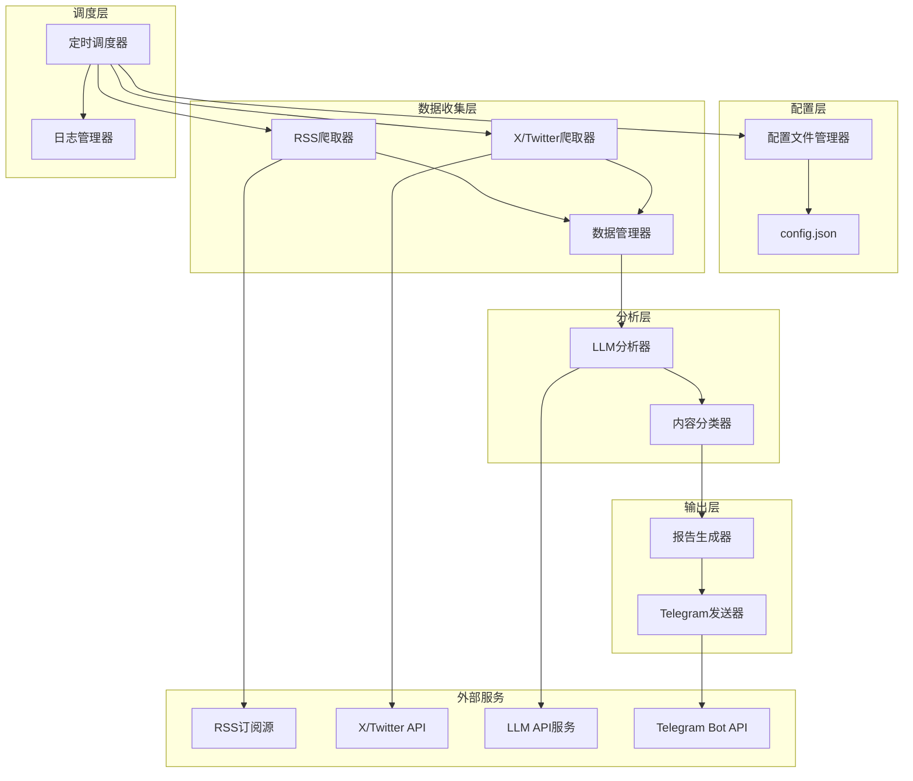

# 设计文档

## 概述

加密货币新闻爬取和分析工具是一个基于Python的自动化系统，采用模块化架构设计。系统通过配置文件管理多个信息源，定时爬取RSS订阅和X/Twitter内容，使用大语言模型进行智能分析和分类，最终生成结构化报告并通过Telegram Bot自动发送。

### 核心功能
- 配置文件驱动的信息源管理
- 多源数据爬取（RSS + X/Twitter）
- LLM驱动的内容分析和分类
- 定时任务调度
- Telegram自动报告发送
- 云服务器部署支持

## 架构

### 系统架构图



### 架构原则
- **模块化设计**: 每个组件职责单一，便于维护和扩展
- **配置驱动**: 通过配置文件管理信息源，无需修改代码
- **插件化架构**: 支持通过插件机制添加新的数据源类型
- **统一接口**: 所有数据源实现相同的接口，便于集成
- **容错设计**: 单个数据源失败不影响整体流程
- **异步处理**: 支持并发爬取提高效率
- **可扩展性**: 易于添加新的数据源和分析规则

## 组件和接口

### 1. 配置文件管理器 (ConfigManager)

负责配置文件的读取、验证和管理。

```python
class ConfigManager:
    def load_config(self) -> Dict[str, Any]
    def validate_config(self, config: Dict[str, Any]) -> bool
    def save_config(self, config: Dict[str, Any]) -> None
    def get_rss_sources(self) -> List[RSSSource]
    def get_x_sources(self) -> List[XSource]
    def get_auth_config(self) -> AuthConfig
    def get_storage_config(self) -> StorageConfig
    def validate_storage_path(self, path: str) -> bool
```

**配置文件结构**:
```json
{
    "execution_interval": 3600,
    "time_window_hours": 24,
    "storage": {
        "retention_days": 30,
        "max_storage_mb": 1000,
        "cleanup_frequency": "daily",
        "database_path": "./data/crypto_news.db"
    },
    "auth": {
        "x_ct0": "...",
        "x_auth_token": "...",
        "llm_api_key": "...",
        "telegram_bot_token": "...",
        "telegram_channel_id": "..."
    },
    "llm_config": {
        "model": "gpt-4",
        "temperature": 0.1,
        "max_tokens": 1000,
        "prompt_config_path": "./prompts/analysis_prompt.json",
        "batch_size": 10
    },
    "rss_sources": [
        {
            "name": "PANews",
            "url": "https://www.panewslab.com/zh/rss/newsflash.xml",
            "description": "快讯"
        }
    ],
    "x_sources": [
        {
            "name": "Crypto List 1",
            "url": "https://x.com/i/lists/1826855418095980750",
            "type": "list"
        }
    ],
    "rest_api_sources": [
        {
            "name": "Custom News API",
            "endpoint": "https://api.example.com/crypto-news",
            "method": "GET",
            "headers": {
                "Authorization": "Bearer ...",
                "Content-Type": "application/json"
            },
            "params": {
                "category": "crypto",
                "limit": 100
            },
            "response_mapping": {
                "title_field": "headline",
                "content_field": "summary",
                "url_field": "link",
                "time_field": "published_at"
            }
        }
    ]
}
```

### 2. RSS爬取器 (RSSCrawler)

使用feedparser库爬取RSS订阅源。

```python
class RSSCrawler:
    def __init__(self, time_window_hours: int)
    def crawl_source(self, source: RSSSource) -> List[ContentItem]
    def crawl_all_sources(self, sources: List[RSSSource]) -> CrawlResult
    def parse_rss_entry(self, entry: Any) -> ContentItem
    def is_within_time_window(self, publish_time: datetime) -> bool
```

**依赖库**: feedparser, requests, beautifulsoup4

### 3. X/Twitter爬取器 (XCrawler)

基于类似bird工具的实现，爬取X/Twitter内容。考虑到X平台的反爬虫机制，采用多重策略降低封控风险。

```python
class XCrawler:
    def __init__(self, ct0: str, auth_token: str, time_window_hours: int)
    def crawl_list(self, list_url: str) -> List[ContentItem]
    def crawl_timeline(self) -> List[ContentItem]
    def crawl_all_sources(self, sources: List[XSource]) -> CrawlResult
    def authenticate(self) -> bool
    def parse_tweet(self, tweet_data: Dict) -> ContentItem
    def implement_rate_limiting(self) -> None
    def rotate_user_agents(self) -> None
    def add_random_delays(self) -> None
    def handle_rate_limit_response(self, response: requests.Response) -> None
```

**反封控策略**:
1. **速率限制**: 严格控制请求频率，模拟人类行为
2. **随机延迟**: 在请求间添加随机延迟（1-5秒）
3. **User-Agent轮换**: 使用多个真实浏览器User-Agent
4. **会话管理**: 维护长期会话，避免频繁登录
5. **错误处理**: 检测429状态码，自动延长等待时间
6. **备用方案**: 当X源不可用时，依然可以通过RSS源获取信息

**风险评估**:
- **高风险**: 频繁大量请求、使用明显的爬虫标识
- **中风险**: 正常频率的API调用，使用真实认证信息
- **低风险**: 模拟人类行为的访问模式

**备用策略**:
如果X爬取受限，系统设计支持：
1. 完全依赖RSS源运行
2. 集成其他社交媒体API（如Mastodon、Bluesky）
3. 使用第三方数据聚合服务

**认证机制**: 使用ct0和auth_token进行会话认证，避免使用官方API的高成本

### 4. 数据管理器 (DataManager)

统一管理爬取到的数据，进行去重、时间过滤和存储管理。

```python
class DataManager:
    def __init__(self, time_window_hours: int, storage_path: str = "./data")
    def add_content_items(self, items: List[ContentItem]) -> None
    def deduplicate_content(self) -> None
    def filter_by_time_window(self) -> None
    def get_all_content(self) -> List[ContentItem]
    def get_crawl_status(self) -> CrawlStatus
    def save_to_local_storage(self, items: List[ContentItem]) -> None
    def load_from_local_storage(self, max_age_days: int = 7) -> List[ContentItem]
    def cleanup_old_data(self, retention_days: int = 30) -> None
    def get_storage_size(self) -> int
    def export_data(self, format: str = "json") -> str
```

**数据存储策略**:
1. **本地存储**: 使用SQLite数据库存储爬取的内容
2. **数据去重**: 基于URL和内容哈希进行去重
3. **时间索引**: 按发布时间建立索引，便于快速查询
4. **自动清理**: 定期删除超过保留期的旧数据
5. **存储优化**: 压缩存储内容，节省磁盘空间

**数据库结构**:
```sql
CREATE TABLE content_items (
    id TEXT PRIMARY KEY,
    title TEXT NOT NULL,
    content TEXT NOT NULL,
    url TEXT UNIQUE NOT NULL,
    publish_time DATETIME NOT NULL,
    source_name TEXT NOT NULL,
    source_type TEXT NOT NULL,
    content_hash TEXT NOT NULL,
    created_at DATETIME DEFAULT CURRENT_TIMESTAMP,
    INDEX idx_publish_time (publish_time),
    INDEX idx_source (source_name, source_type),
    INDEX idx_content_hash (content_hash)
);
```

**数据清理机制**:
- **默认保留期**: 30天
- **清理频率**: 每次执行时检查
- **清理策略**: 删除超过保留期且不在当前时间窗口内的数据
- **存储监控**: 监控磁盘使用量，超过阈值时提前清理

### 5. LLM分析器 (LLMAnalyzer)

与大语言模型API集成，使用精心设计的提示词进行内容分析和分类。

```python
class LLMAnalyzer:
    def __init__(self, api_key: str, model: str = "gpt-4", prompt_config_path: str = "./prompts/analysis_prompt.json")
    def analyze_content(self, content: str) -> AnalysisResult
    def batch_analyze(self, items: List[ContentItem]) -> List[AnalysisResult]
    def classify_content(self, content: str) -> ContentCategory
    def should_ignore_content(self, content: str) -> bool
    def build_analysis_prompt(self, content: str) -> str
    def parse_llm_response(self, response: str) -> AnalysisResult
    def reload_prompt_config(self) -> None
    def validate_category_response(self, category: str) -> bool
```

**LLM提示词设计**:

系统支持灵活的提示词配置，用户可以通过配置文件自定义分析标准和提示词模板：

```python
class PromptManager:
    def __init__(self, config_path: str = "./prompts/analysis_prompt.json")
    def load_prompt_template(self) -> str
    def load_categories_config(self) -> Dict[str, CategoryConfig]
    def build_analysis_prompt(self, content: str, categories: Dict[str, CategoryConfig]) -> str
    def validate_prompt_template(self, template: str) -> bool
    def reload_configuration(self) -> None

@dataclass
class CategoryConfig:
    name: str
    description: str
    criteria: List[str]
    examples: List[str]
    priority: int = 1
```

**提示词配置文件结构** (`./prompts/analysis_prompt.json`):

```json
{
    "prompt_template": "你是一个专业的加密货币新闻分析师。请分析以下内容并进行分类。\n\n## 分析标准\n\n### 需要关注的内容类别：\n\n{categories_description}\n\n### 需要忽略的内容：\n\n{ignore_criteria}\n\n## 分析任务\n\n请分析以下内容：\n\n---\n标题：{title}\n内容：{content}\n来源：{source}\n---\n\n## 输出格式\n\n{output_format}",
    
    "categories": {
        "大户动向": {
            "description": "大户资金流动和态度变化",
            "criteria": [
                "巨鲸资金流入流出（单笔>1000 ETH或等值）",
                "大户对crypto市场的态度变化（增持/减持/公开表态）",
                "知名地址的链上操作"
            ],
            "examples": [
                "某巨鲸地址转移10000 ETH到交易所",
                "MicroStrategy宣布增持比特币"
            ],
            "priority": 1
        },
        "利率事件": {
            "description": "美联储相关的利率政策事件",
            "criteria": [
                "美联储委员的发言表态",
                "FOMC会议相关消息",
                "利率政策预期变化"
            ],
            "examples": [
                "鲍威尔发表鹰派言论",
                "FOMC会议纪要显示加息预期"
            ],
            "priority": 1
        },
        "美国政府监管政策": {
            "description": "美国政府对加密货币的监管政策变化",
            "criteria": [
                "SEC/CFTC/财政部重大政策调整",
                "立法进展（国会法案）",
                "监管执法行动"
            ],
            "examples": [
                "SEC批准比特币ETF",
                "国会通过加密货币监管法案"
            ],
            "priority": 1
        },
        "安全事件": {
            "description": "影响较大的安全相关事件",
            "criteria": [
                "黑客攻击、漏洞披露（影响较大的）",
                "资金被盗、协议被黑",
                "重大安全预警"
            ],
            "examples": [
                "某DeFi协议被黑客攻击损失1000万美元",
                "发现智能合约重大漏洞"
            ],
            "priority": 1
        },
        "新产品": {
            "description": "KOL提及的真正创新产品（非广告）",
            "criteria": [
                "KOL提及的新项目/协议",
                "必须是真正的创新，不是项目方广告",
                "特别注意：如果疑似广告软文则归类为'忽略'"
            ],
            "examples": [
                "V神推荐的新Layer2解决方案",
                "知名开发者发布的新DeFi协议"
            ],
            "priority": 2
        },
        "市场新现象": {
            "description": "重要的市场新趋势和变化",
            "criteria": [
                "新趋势、新变化",
                "链上数据异常",
                "新的市场模式"
            ],
            "examples": [
                "NFT市场出现新的交易模式",
                "链上活跃度异常增长"
            ],
            "priority": 2
        }
    },
    
    "ignore_criteria": [
        "广告和软文 - 明显的推广内容",
        "重复信息 - 与已有信息重复的内容",
        "情绪发泄 - 纯粹的情绪表达，无实质信息",
        "空洞的道理和预测 - 没有具体依据的预测或泛泛而谈",
        "立场争论和口水仗 - 争论性内容，无实质信息价值"
    ],
    
    "output_format": "请严格按照以下JSON格式输出：\n\n{\n    \"category\": \"类别名称\",\n    \"confidence\": 0.85,\n    \"reasoning\": \"详细说明分类理由\",\n    \"should_ignore\": false,\n    \"key_points\": [\"关键信息点1\", \"关键信息点2\"]\n}",
    
    "llm_settings": {
        "temperature": 0.1,
        "max_tokens": 1000,
        "model": "gpt-4"
    }
}
```

**动态分类系统**:

```python
class DynamicCategoryManager:
    def __init__(self, config_path: str = "./prompts/analysis_prompt.json")
    def load_categories(self) -> Dict[str, CategoryConfig]
    def add_category(self, name: str, config: CategoryConfig) -> None
    def remove_category(self, name: str) -> None
    def update_category(self, name: str, config: CategoryConfig) -> None
    def get_category_enum(self) -> Enum
    def validate_category_config(self, config: CategoryConfig) -> bool
    def reload_categories(self) -> None

# 动态生成的ContentCategory枚举
def create_content_category_enum(categories: Dict[str, CategoryConfig]) -> Enum:
    category_dict = {
        name.upper().replace(' ', '_'): name 
        for name in categories.keys()
    }
    category_dict['UNCATEGORIZED'] = '未分类'
    category_dict['IGNORED'] = '忽略'
    
    return Enum('ContentCategory', category_dict)
```

**支持的LLM服务**: OpenAI GPT, Anthropic Claude, 其他兼容OpenAI API的服务

### 6. 内容分类器 (ContentClassifier)

基于LLM分析结果进行内容分类。

```python
class ContentClassifier:
    def classify_item(self, item: ContentItem, analysis: AnalysisResult) -> ContentCategory
    def get_category_items(self, category: ContentCategory) -> List[ContentItem]
    def generate_category_summary(self, category: ContentCategory) -> str
```

**分类类别**:
- 大户动向 (WHALE_MOVEMENTS)
- 利率事件 (INTEREST_RATE_EVENTS)  
- 美国政府监管政策 (US_REGULATORY_POLICY)
- 安全事件 (SECURITY_EVENTS)
- 新产品 (NEW_PRODUCTS)
- 市场新现象 (MARKET_PHENOMENA)
- 未分类 (UNCATEGORIZED)
- 忽略 (IGNORED)

### 7. 报告生成器 (ReportGenerator)

生成Markdown格式的结构化报告。

```python
class ReportGenerator:
    def generate_report(self, data: AnalyzedData, status: CrawlStatus) -> str
    def generate_header(self, time_window: int) -> str
    def generate_status_table(self, status: CrawlStatus) -> str
    def generate_category_section(self, category: ContentCategory, items: List[ContentItem]) -> str
    def generate_summary(self, categories: Dict[ContentCategory, List[ContentItem]]) -> str
```

### 8. Telegram发送器 (TelegramSender)

通过Telegram Bot API发送报告。

```python
class TelegramSender:
    def __init__(self, bot_token: str, channel_id: str)
    def send_report(self, report: str) -> bool
    def validate_bot_token(self) -> bool
    def validate_channel_access(self) -> bool
    def split_long_message(self, message: str) -> List[str]
```

**依赖库**: python-telegram-bot 或 pyTelegramBotAPI

### 9. 定时调度器 (Scheduler)

管理定时任务执行。

```python
class Scheduler:
    def __init__(self, interval_seconds: int)
    def start_daemon(self) -> None
    def stop_daemon(self) -> None
    def run_once(self) -> None
    def schedule_next_run(self) -> None
    def is_running(self) -> bool
```

**依赖库**: schedule, threading

### 11. 数据源工厂 (DataSourceFactory)

支持插件化的数据源管理，便于扩展新的数据源类型。

```python
class DataSourceInterface:
    """所有数据源必须实现的统一接口"""
    def crawl(self, config: Dict[str, Any], time_window_hours: int) -> CrawlResult
    def validate_config(self, config: Dict[str, Any]) -> bool
    def get_source_type(self) -> str

class DataSourceFactory:
    def __init__(self):
        self.registered_sources = {}
    
    def register_source(self, source_type: str, source_class: Type[DataSourceInterface])
    def create_source(self, source_type: str, config: Dict[str, Any]) -> DataSourceInterface
    def get_available_source_types(self) -> List[str]
    def validate_source_config(self, source_type: str, config: Dict[str, Any]) -> bool

class RESTAPICrawler(DataSourceInterface):
    """REST API数据源实现示例"""
    def crawl(self, config: Dict[str, Any], time_window_hours: int) -> CrawlResult
    def validate_config(self, config: Dict[str, Any]) -> bool
    def get_source_type(self) -> str
    def make_api_request(self, endpoint: str, params: Dict) -> Dict
    def parse_api_response(self, response: Dict) -> List[ContentItem]
```

**扩展新数据源的步骤**:
1. 实现`DataSourceInterface`接口
2. 在工厂中注册新的数据源类型
3. 在配置文件中添加相应的配置项
4. 系统自动支持新数据源的爬取

### 12. 日志管理器 (LogManager)

```python
class LogManager:
    def setup_logging(self, log_level: str = "INFO") -> None
    def log_crawl_status(self, status: CrawlStatus) -> None
    def log_analysis_results(self, results: List[AnalysisResult]) -> None
    def log_error(self, component: str, error: Exception) -> None
    def log_execution_summary(self, summary: ExecutionSummary) -> None
```

## 数据模型

### 核心数据结构

```python
@dataclass
class ContentItem:
    id: str
    title: str
    content: str
    url: str
    publish_time: datetime
    source_name: str
    source_type: str  # "rss" or "x"

@dataclass
class RSSSource:
    name: str
    url: str
    description: str

@dataclass
class XSource:
    name: str
    url: str
    type: str  # "list" or "timeline"

@dataclass
class RESTAPISource:
    name: str
    endpoint: str
    method: str
    headers: Dict[str, str]
    params: Dict[str, Any]
    response_mapping: Dict[str, str]  # 字段映射配置

@dataclass
class AuthConfig:
    x_ct0: str
    x_auth_token: str
    llm_api_key: str
    telegram_bot_token: str
    telegram_channel_id: str

@dataclass
class StorageConfig:
    retention_days: int = 30
    max_storage_mb: int = 1000
    cleanup_frequency: str = "daily"
    database_path: str = "./data/crypto_news.db"

@dataclass
class AnalysisResult:
    content_id: str
    category: ContentCategory
    confidence: float
    reasoning: str
    should_ignore: bool
    key_points: List[str]

@dataclass
class CrawlResult:
    source_name: str
    status: str  # "success" or "error"
    item_count: int
    error_message: Optional[str]

@dataclass
class CrawlStatus:
    rss_results: List[CrawlResult]
    x_results: List[CrawlResult]
    total_items: int
    execution_time: datetime

# 动态生成的ContentCategory枚举，基于配置文件
# 示例：如果配置文件包含上述类别，则生成：
# ContentCategory = Enum('ContentCategory', {
#     'WHALE_MOVEMENTS': '大户动向',
#     'INTEREST_RATE_EVENTS': '利率事件', 
#     'US_REGULATORY_POLICY': '美国政府监管政策',
#     'SECURITY_EVENTS': '安全事件',
#     'NEW_PRODUCTS': '新产品',
#     'MARKET_PHENOMENA': '市场新现象',
#     'UNCATEGORIZED': '未分类',
#     'IGNORED': '忽略'
# })
```

## 错误处理

### 错误处理策略

1. **网络错误**: 重试机制，最多3次重试，指数退避
2. **认证错误**: 立即失败，记录详细错误信息
3. **解析错误**: 跳过单个项目，继续处理其他内容
4. **API限制**: 实现速率限制和队列机制
5. **配置错误**: 启动时验证，提供详细错误提示

### 错误恢复机制

```python
class ErrorHandler:
    def handle_network_error(self, error: Exception, retry_count: int) -> bool
    def handle_auth_error(self, service: str, error: Exception) -> None
    def handle_parsing_error(self, item: Any, error: Exception) -> None
    def handle_api_rate_limit(self, service: str) -> None
    def generate_error_report(self, errors: List[Exception]) -> str
```

## 测试策略

### 单元测试
- 每个组件的核心功能测试
- 配置文件解析和验证测试
- 数据模型序列化/反序列化测试
- 错误处理逻辑测试

### 集成测试
- RSS爬取器与实际RSS源的集成测试
- X爬取器与模拟API的集成测试
- LLM分析器与模拟API的集成测试
- Telegram发送器与模拟Bot API的集成测试

### 端到端测试
- 完整工作流程测试（使用测试配置）
- 定时调度功能测试
- 错误恢复场景测试

### 测试工具和框架
- **单元测试**: pytest
- **模拟**: unittest.mock, responses
- **测试数据**: 预定义的RSS和X内容样本
- **CI/CD**: GitHub Actions 或类似平台

测试覆盖率目标: 80%以上

## 正确性属性

*属性是一个特征或行为，应该在系统的所有有效执行中保持为真——本质上，是关于系统应该做什么的正式陈述。属性作为人类可读规范和机器可验证正确性保证之间的桥梁。*

基于需求分析，以下是系统必须满足的正确性属性：

### 属性 1: 参数接受和验证
*对于任何*有效的配置参数集合（时间窗口、认证信息、Telegram配置），系统应该成功接受并保存这些参数，而对于无效参数应该返回明确的错误信息
**验证: 需求 1.1, 1.2, 1.3, 1.4, 1.5**

### 属性 2: 配置持久化一致性
*对于任何*有效的配置参数，保存后重新读取应该得到相同的配置值
**验证: 需求 1.8**

### 属性 3: 配置文件管理
*对于任何*系统启动，如果配置文件不存在，系统应该创建包含默认信息源的配置文件；如果存在，应该成功验证其有效性
**验证: 需求 2.1, 2.5, 2.6**

### 属性 4: 内容解析完整性
*对于任何*有效的RSS或X内容，解析后的ContentItem应该包含标题、内容、发布时间和原文链接等所有必需字段
**验证: 需求 3.4, 4.5**

### 属性 5: 内容分类一致性
*对于任何*输入内容，LLM分析器应该将其分类到六大预定义类别之一，或标记为未分类/忽略
**验证: 需求 5.1, 5.3**

### 属性 6: 报告格式完整性
*对于任何*生成的报告，应该包含时间窗口信息的头部、数据源状态表格，以及每条信息的原文链接
**验证: 需求 7.1, 7.4**

### 属性 7: Telegram发送可靠性
*对于任何*生成的报告，如果Telegram配置有效，系统应该成功发送报告到指定频道
**验证: 需求 8.1**

### 属性 8: 定时调度准确性
*对于任何*配置的执行间隔，调度器应该按照该间隔自动触发分析任务
**验证: 需求 9.2**

### 属性 9: 时间窗口过滤正确性
*对于任何*内容项，只有发布时间在指定时间窗口内的内容应该被包含在最终分析中
**验证: 需求 10.1**

### 属性 10: 容错处理一致性
*对于任何*数据源失败，系统应该记录错误信息并继续处理其他可用数据源，不应该导致整个流程中断
**验证: 需求 11.1**

## 系统扩展性

### 添加新数据源类型

系统采用插件化架构，支持轻松添加新的数据源类型。以下是添加REST API数据源的完整示例：

#### 1. 实现数据源接口

```python
class RESTAPICrawler(DataSourceInterface):
    def __init__(self, config: RESTAPISource):
        self.config = config
        self.session = requests.Session()
        self.session.headers.update(config.headers)
    
    def crawl(self, config: Dict[str, Any], time_window_hours: int) -> CrawlResult:
        try:
            response = self.make_api_request()
            items = self.parse_api_response(response, time_window_hours)
            return CrawlResult(
                source_name=self.config.name,
                status="success",
                item_count=len(items),
                error_message=None
            )
        except Exception as e:
            return CrawlResult(
                source_name=self.config.name,
                status="error",
                item_count=0,
                error_message=str(e)
            )
    
    def validate_config(self, config: Dict[str, Any]) -> bool:
        required_fields = ["endpoint", "method", "response_mapping"]
        return all(field in config for field in required_fields)
    
    def get_source_type(self) -> str:
        return "rest_api"
```

#### 2. 注册新数据源

```python
# 在系统初始化时注册
factory = DataSourceFactory()
factory.register_source("rest_api", RESTAPICrawler)
factory.register_source("rss", RSSCrawler)
factory.register_source("x", XCrawler)
```

#### 3. 配置文件支持

系统自动支持新的配置节，无需修改核心代码：

```json
{
    "rest_api_sources": [
        {
            "name": "Custom API",
            "endpoint": "https://api.example.com/news",
            "method": "GET",
            "headers": {"Authorization": "Bearer token"},
            "response_mapping": {
                "title_field": "title",
                "content_field": "body",
                "url_field": "url",
                "time_field": "created_at"
            }
        }
    ]
}
```

### 扩展分析规则

系统支持通过配置文件灵活调整分析规则和分类标准：

#### 1. 修改现有分类标准

编辑 `./prompts/analysis_prompt.json` 文件：

```json
{
    "categories": {
        "大户动向": {
            "criteria": [
                "巨鲸资金流入流出（单笔>500 ETH或等值）",  // 降低阈值
                "大户对crypto市场的态度变化",
                "知名地址的链上操作",
                "机构投资者的持仓变化"  // 新增标准
            ]
        }
    }
}
```

#### 2. 添加新的分类类别

```json
{
    "categories": {
        "技术发展": {
            "description": "区块链技术相关的重要发展",
            "criteria": [
                "重要的技术升级或硬分叉",
                "新的共识机制或扩容方案",
                "跨链技术突破"
            ],
            "examples": [
                "以太坊2.0升级完成",
                "新的Layer2解决方案上线"
            ],
            "priority": 2
        }
    }
}
```

#### 3. 自定义提示词模板

```json
{
    "prompt_template": "你是一个{expertise}专家。请根据以下标准分析内容：\n\n{categories_description}\n\n分析内容：{content}\n\n{output_format}",
    "template_variables": {
        "expertise": "加密货币市场分析"
    }
}
```

#### 4. 动态重载配置

```python
# 系统支持运行时重载配置，无需重启
analyzer.reload_prompt_config()
category_manager.reload_categories()
```

### 扩展输出格式

支持添加新的报告输出格式：

```python
class JSONReportGenerator(ReportGeneratorInterface):
    def generate_report(self, data: AnalyzedData) -> str:
        return json.dumps(self.format_as_json(data), ensure_ascii=False)

# 注册新的输出格式
report_factory.register_generator("json", JSONReportGenerator)
```

### 未来扩展可能性

1. **新数据源类型**:
   - GraphQL API
   - WebSocket实时数据流
   - 数据库直连
   - 文件系统监控

2. **新分析引擎**:
   - 本地LLM模型
   - 专门的金融分析模型
   - 多模态分析（图片、视频）

3. **新输出渠道**:
   - 邮件发送
   - Slack集成
   - 微信机器人
   - Web Dashboard

4. **新调度策略**:
   - 基于事件的触发
   - 智能调度（根据市场活跃度）
   - 分布式调度

## 错误处理

### 错误分类和处理策略

1. **配置错误**
   - 无效参数格式
   - 缺失必需配置
   - 认证信息错误
   - 处理: 立即失败，提供详细错误信息

2. **网络错误**
   - 连接超时
   - DNS解析失败
   - HTTP错误状态码
   - 处理: 重试机制（最多3次），指数退避

3. **解析错误**
   - RSS格式无效
   - JSON解析失败
   - 数据字段缺失
   - 处理: 跳过单个项目，记录警告，继续处理

4. **API错误**
   - 认证失败
   - 速率限制（特别是X平台的429错误）
   - 服务不可用
   - 账户被限制或封禁
   - 处理: 根据错误类型采用不同策略，X平台错误采用指数退避

5. **系统错误**
   - 磁盘空间不足
   - 数据库连接失败
   - 文件权限错误
   - 内存不足
   - 处理: 优雅降级，保存当前状态，触发数据清理

### 错误恢复机制

```python
class ErrorRecoveryManager:
    def __init__(self):
        self.retry_strategies = {
            NetworkError: ExponentialBackoffRetry(max_retries=3),
            AuthError: NoRetryStrategy(),
            ParseError: SkipAndContinueStrategy(),
            RateLimitError: DelayRetryStrategy(),
            XPlatformRateLimitError: ExtendedDelayRetryStrategy(base_delay=900)  # 15分钟基础延迟
        }
    
    def handle_error(self, error: Exception, context: str) -> RecoveryAction
    def should_retry(self, error: Exception, attempt: int) -> bool
    def calculate_delay(self, attempt: int) -> float
    def handle_x_platform_errors(self, response_code: int) -> RecoveryAction
    def log_recovery_action(self, action: RecoveryAction) -> None
```

## 测试策略

### 双重测试方法
- **单元测试**: 验证特定示例、边界情况和错误条件
- **属性测试**: 验证所有输入的通用属性
- 两者互补，对于全面覆盖都是必需的

### 单元测试重点
单元测试应专注于：
- 演示正确行为的特定示例
- 组件之间的集成点
- 边界情况和错误条件

### 属性测试配置
- 每个属性测试最少100次迭代（由于随机化）
- 每个属性测试必须引用其设计文档属性
- 标签格式: **功能: crypto-news-analyzer, 属性 {编号}: {属性文本}**
- 每个正确性属性必须由单个属性测试实现

### 测试库选择
- **Python**: 使用Hypothesis进行属性测试
- **单元测试**: pytest框架
- **模拟**: unittest.mock, responses库
- **集成测试**: 使用测试容器和模拟服务

### 测试数据生成策略
- **RSS内容**: 生成各种格式的RSS feed样本
- **X内容**: 模拟不同类型的推文数据
- **配置文件**: 生成有效和无效的配置组合
- **时间数据**: 生成各种时间戳和时间窗口组合

### 性能测试
- **负载测试**: 模拟大量RSS源和X内容
- **并发测试**: 验证多线程爬取的正确性
- **内存测试**: 确保长时间运行不会内存泄漏
- **网络测试**: 模拟各种网络条件和故障

### 集成测试场景
1. **完整工作流程**: 从配置读取到报告发送的端到端测试
2. **错误恢复**: 模拟各种故障场景的恢复测试
3. **定时调度**: 验证调度器在各种条件下的行为
4. **多数据源**: 测试同时处理多个RSS和X源的能力

测试覆盖率目标: 85%以上，关键路径100%覆盖