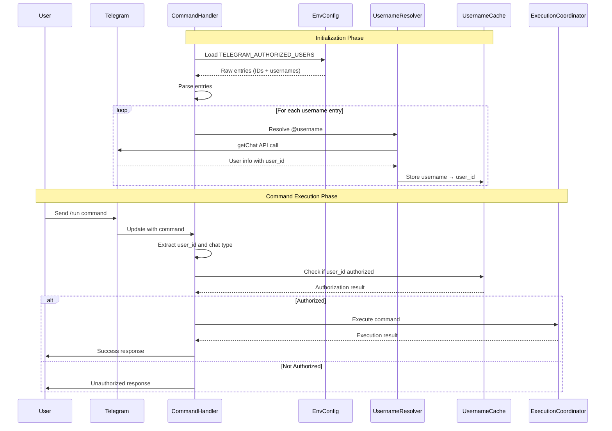

# Design Document: Telegram Multi-User Authorization

## Overview

This design enhances the Telegram bot authorization system to support multiple authorized users interacting with the bot in both private chats and group chats. The current implementation only validates commands against the TELEGRAM_CHANNEL_ID, which limits bot interaction to a single channel context.

The enhancement modifies the authorization validation logic in the `TelegramCommandHandler` class to:

1. Load authorized users from environment variable (TELEGRAM_AUTHORIZED_USERS)
2. Support both numeric user IDs and @username format
3. Resolve usernames to user IDs using Telegram Bot API
4. Cache username-to-user_id mappings for performance
5. Accept commands from authorized users in private chats (one-on-one conversations)
6. Accept commands from authorized users in group chats (multi-participant conversations)
7. Validate the sender's user_id rather than the chat_id
8. Maintain backward compatibility with existing channel-based report sending

**Key Design Principle:** The authorization model shifts from "where the command comes from" (chat_id) to "who sends the command" (user_id), enabling flexible multi-context interaction while preserving existing functionality. User IDs are stored in environment variables to protect privacy. Usernames provide a human-readable alternative to numeric IDs, with automatic resolution and caching for efficiency.

## Architecture

### Current Architecture

```
User → Private Chat/Group Chat → Bot
                                   ↓
                            Command Handler
                                   ↓
                          Authorization Check
                          (Currently: config.json)
                                   ↓
                            Command Execution
```

### Enhanced Architecture

```
User → Private Chat/Group Chat → Bot
                                   ↓
                            Command Handler
                                   ↓
                          Chat Context Detection
                          (Private vs Group)
                                   ↓
                          Authorization Check
                          (User_ID from env var + username cache)
                                   ↓
                            Command Execution
```

### Initialization Flow

```
Bot Startup
    ↓
Load TELEGRAM_AUTHORIZED_USERS
    ↓
Parse entries (user IDs and usernames)
    ↓
For each username entry:
    ↓
Resolve username → user_id via Telegram API
    ↓
Cache username → user_id mapping
    ↓
Ready to accept commands
```

### Component Interaction



## Components and Interfaces

### Modified Components

#### 1. TelegramCommandHandler

**Location:** `crypto_news_analyzer/reporters/telegram_command_handler.py`

**Current Behavior:**
- Validates commands using `is_authorized_user()` method
- Checks user_id against authorized_users list from config.json
- Does not distinguish between chat contexts

**Enhanced Behavior:**
- Load authorized entries from TELEGRAM_AUTHORIZED_USERS environment variable
- Parse both numeric user IDs and @username entries
- Resolve usernames to user IDs using Telegram Bot API during initialization
- Cache username-to-user_id mappings for efficient lookups
- Extract chat context from Telegram Update object
- Validate sender's user_id against both direct IDs and resolved username IDs
- Apply same authorization logic for private and group chats
- Log chat context information for audit purposes
- Handle username resolution failures gracefully

**Modified Methods:**

```python
async def _handle_run_command(self, update: Update, context: ContextTypes.DEFAULT_TYPE) -> None:
    """
    Enhanced to extract and log chat context information
    """
    user = update.effective_user
    chat = update.effective_chat
    user_id = str(user.id)
    username = user.username or user.first_name
    chat_type = chat.type  # "private", "group", or "supergroup"
    chat_id = str(chat.id)
    
    # Log chat context
    self.logger.info(
        f"Received /run command from user {username} ({user_id}) "
        f"in {chat_type} chat ({chat_id})"
    )
    
    # Existing authorization logic continues...
```

```python
async def _handle_status_command(self, update: Update, context: ContextTypes.DEFAULT_TYPE) -> None:
    """
    Enhanced to extract and log chat context information
    """
    # Similar enhancement as _handle_run_command
```

```python
async def _handle_help_command(self, update: Update, context: ContextTypes.DEFAULT_TYPE) -> None:
    """
    Enhanced to extract and log chat context information
    """
    # Similar enhancement as _handle_run_command
```

**No Changes Required:**
- `check_rate_limit()` - Works per user_id, no changes needed

**Modified Methods:**
- `__init__()` - Load authorized users from environment variable instead of config
- `_load_authorized_users()` - Parse TELEGRAM_AUTHORIZED_USERS environment variable
- `is_authorized_user()` - Simplified to check user_id against loaded set

**Removed Methods:**
- `validate_user_permissions()` - No longer needed (all authorized users have same permissions)

### New Helper Methods

#### Authorization Loading from Environment

```python
def _load_authorized_users(self) -> None:
    """
    Load authorized user IDs from environment variable
    
    Reads TELEGRAM_AUTHORIZED_USERS environment variable containing
    comma-separated list of Telegram user IDs and/or usernames.
    
    Example: TELEGRAM_AUTHORIZED_USERS="123456789,@username1,987654321,@username2"
    
    Usernames are resolved to user IDs using Telegram Bot API and cached.
    """
    import os
    
    authorized_users_str = os.getenv('TELEGRAM_AUTHORIZED_USERS', '')
    
    if not authorized_users_str:
        self.logger.warning("No authorized users configured in TELEGRAM_AUTHORIZED_USERS")
        self._authorized_user_ids = set()
        return
    
    # Parse comma-separated entries
    user_ids = set()
    usernames_to_resolve = []
    
    for entry in authorized_users_str.split(','):
        entry = entry.strip()
        
        if not entry:
            continue
            
        if entry.isdigit():
            # Direct user ID
            user_ids.add(entry)
        elif entry.startswith('@'):
            # Username to resolve
            usernames_to_resolve.append(entry)
        else:
            self.logger.warning(f"Invalid entry in TELEGRAM_AUTHORIZED_USERS: {entry}")
    
    # Resolve usernames to user IDs
    for username in usernames_to_resolve:
        try:
            user_id = self._resolve_username(username)
            if user_id:
                user_ids.add(user_id)
                self._username_cache[username] = user_id
                self.logger.info(f"Resolved username {username} to user_id {user_id}")
        except Exception as e:
            self.logger.error(f"Failed to resolve username {username}: {e}")
    
    self._authorized_user_ids = user_ids
    self.logger.info(
        f"Loaded {len(self._authorized_user_ids)} authorized users from environment "
        f"({len(usernames_to_resolve)} from usernames)"
    )

def _resolve_username(self, username: str) -> Optional[str]:
    """
    Resolve a Telegram username to user_id using Bot API
    
    Args:
        username: Telegram username (with or without @ prefix)
        
    Returns:
        User ID as string, or None if resolution fails
        
    Raises:
        Exception: If API call fails
    """
    # Remove @ prefix if present
    username_clean = username.lstrip('@')
    
    try:
        # Use getChat API to resolve username
        # This requires the bot to have interacted with the user before
        # or the user to have a public profile
        chat = self.application.bot.get_chat(f"@{username_clean}")
        
        if chat and chat.id:
            return str(chat.id)
        else:
            self.logger.warning(f"Could not resolve username {username}: user not found")
            return None
            
    except Exception as e:
        self.logger.error(f"Error resolving username {username}: {e}")
        return None

def is_authorized_user(self, user_id: str, username: str = None) -> bool:
    """
    Verify if user is authorized to execute commands
    
    Args:
        user_id: Telegram user ID
        username: Telegram username (optional, for logging only)
        
    Returns:
        True if user is authorized, False otherwise
    """
    if not self.config.enabled:
        return False
    
    user_id_str = str(user_id)
    return user_id_str in self._authorized_user_ids
```

#### Chat Context Extraction

```python
def _extract_chat_context(self, update: Update) -> Dict[str, Any]:
    """
    Extract chat context information from Telegram update
    
    Args:
        update: Telegram Update object
        
    Returns:
        Dictionary containing:
        - user_id: Sender's user ID
        - username: Sender's username
        - chat_id: Chat ID
        - chat_type: "private", "group", or "supergroup"
        - is_private: Boolean indicating private chat
        - is_group: Boolean indicating group chat
    """
    user = update.effective_user
    chat = update.effective_chat
    
    return {
        "user_id": str(user.id),
        "username": user.username or user.first_name,
        "chat_id": str(chat.id),
        "chat_type": chat.type,
        "is_private": chat.type == "private",
        "is_group": chat.type in ["group", "supergroup"]
    }
```

#### Enhanced Logging

```python
def _log_authorization_attempt(
    self,
    command: str,
    user_id: str,
    username: str,
    chat_type: str,
    chat_id: str,
    authorized: bool,
    reason: str = None
) -> None:
    """
    Log authorization attempt with full context
    
    Args:
        command: Command name
        user_id: User ID
        username: Username
        chat_type: Type of chat (private/group/supergroup)
        chat_id: Chat ID
        authorized: Whether authorization succeeded
        reason: Reason for authorization failure (if applicable)
    """
    log_message = (
        f"Authorization attempt: command={command}, "
        f"user={username} ({user_id}), "
        f"chat_type={chat_type}, chat_id={chat_id}, "
        f"authorized={authorized}"
    )
    
    if reason:
        log_message += f", reason={reason}"
    
    if authorized:
        self.logger.info(log_message)
    else:
        self.logger.warning(log_message)
```

## Data Models

### Existing Models (Modified)

#### TelegramCommandConfig
```python
@dataclass
class TelegramCommandConfig:
    """Telegram command configuration"""
    enabled: bool = True
    execution_timeout_minutes: int = 30
    max_concurrent_executions: int = 1
    command_rate_limit: Dict[str, int] = None
    # Note: authorized_users removed - now loaded from environment variable
```

#### Environment Variables (New)
```bash
# Telegram Bot Configuration
TELEGRAM_BOT_TOKEN=your_bot_token_here
TELEGRAM_CHANNEL_ID=your_channel_id_here

# Authorized Users (comma-separated Telegram user IDs and/or usernames)
# Supports mixed format: numeric IDs and @username entries
TELEGRAM_AUTHORIZED_USERS=123456789,@username1,987654321,@username2
```

### New Data Structures

#### UsernameCache (Internal)
```python
# Instance variable in TelegramCommandHandler
self._username_cache: Dict[str, str] = {}  # username -> user_id mapping
```

This cache stores resolved username-to-user_id mappings to avoid repeated API calls. The cache is populated during initialization and can be refreshed periodically if needed.

#### ChatContext (Internal)
```python
@dataclass
class ChatContext:
    """
    Chat context information extracted from Telegram update
    """
    user_id: str
    username: str
    chat_id: str
    chat_type: str  # "private", "group", "supergroup"
    is_private: bool
    is_group: bool
    
    @property
    def context_description(self) -> str:
        """Human-readable context description"""
        return f"{self.chat_type} chat ({self.chat_id})"
```

## Implementation Strategy

### Phase 1: Update Authorization Loading

1. Modify `_load_authorized_users()` to read from environment variable
2. Parse comma-separated entries (both user IDs and usernames)
3. Identify numeric entries as direct user IDs
4. Identify entries starting with "@" as usernames
5. Validate and filter invalid entries
6. Store direct user IDs in `_authorized_user_ids` set

### Phase 2: Implement Username Resolution

1. Create `_resolve_username()` method to call Telegram Bot API
2. Use `getChat` API endpoint to resolve username to user_id
3. Handle API errors gracefully (user not found, network errors)
4. Add resolved user_ids to `_authorized_user_ids` set
5. Store username-to-user_id mappings in `_username_cache`
6. Log resolution successes and failures

### Phase 3: Simplify Authorization Logic

1. Update `is_authorized_user()` to check against `_authorized_user_ids` set
2. Remove `validate_user_permissions()` method (no longer needed)
3. Remove permission checking from command handlers

### Phase 4: Add Chat Context Extraction

1. Implement `_extract_chat_context()` helper method
2. Implement `ChatContext` dataclass
3. Update all command handlers to extract chat context
4. Add chat context to log messages

### Phase 4: Add Chat Context Extraction

1. Implement `_extract_chat_context()` helper method
2. Implement `ChatContext` dataclass
3. Update all command handlers to extract chat context
4. Add chat context to log messages

### Phase 5: Enhance Authorization Logging

1. Implement `_log_authorization_attempt()` method
2. Update authorization checks to use enhanced logging
3. Include chat type and chat_id in all authorization logs

### Phase 6: Update Command Handlers

1. Modify `_handle_run_command()` to extract and log chat context
2. Modify `_handle_status_command()` to extract and log chat context
3. Modify `_handle_help_command()` to extract and log chat context
4. Remove permission validation calls (all authorized users have same permissions)

### Phase 7: Update Configuration

1. Remove `authorized_users` from config.json telegram_commands section
2. Update .env.template with TELEGRAM_AUTHORIZED_USERS example showing mixed format
3. Update documentation to reflect environment variable usage and username support

### Phase 8: Testing and Validation

1. Test username resolution with valid usernames
2. Test username resolution with invalid usernames
3. Test username resolution with API errors
4. Test mixed format (user IDs + usernames) in environment variable
5. Test private chat authorization with authorized users
6. Test private chat authorization with unauthorized users
7. Test group chat authorization with authorized users
8. Test group chat authorization with unauthorized users
9. Test environment variable parsing with various formats
10. Verify backward compatibility with channel reporting
11. Verify rate limiting works across contexts
12. Verify username cache is populated correctly

## Error Handling

### Authorization Failures

**Scenario:** Unauthorized user attempts command
- **Detection:** `is_authorized_user()` returns False
- **Response:** Send permission denied message to user
- **Logging:** Log warning with user_id, username, chat context
- **User Message:** "❌ 权限拒绝\n\n您没有权限执行此命令。"

### Chat Context Extraction Failures

**Scenario:** Unable to extract user or chat information
- **Detection:** Missing effective_user or effective_chat in Update
- **Response:** Log error and send generic error message
- **Logging:** Log error with available Update information
- **User Message:** "❌ 处理命令时发生错误"
- **Recovery:** Gracefully reject command without crashing

### Environment Variable Issues

**Scenario:** TELEGRAM_AUTHORIZED_USERS is empty or not set
- **Detection:** During initialization, check environment variable
- **Response:** Log warning but continue operation
- **Logging:** "No authorized users configured in TELEGRAM_AUTHORIZED_USERS"
- **Behavior:** All commands will be rejected (expected behavior)

**Scenario:** Malformed entry in environment variable
- **Detection:** During parsing, validate each entry (numeric or starts with @)
- **Response:** Skip invalid entries, log warning
- **Logging:** "Invalid entry in TELEGRAM_AUTHORIZED_USERS: {entry}"
- **Recovery:** Continue with valid entries

### Username Resolution Failures

**Scenario:** Username not found (user doesn't exist or hasn't interacted with bot)
- **Detection:** Telegram API returns user not found error
- **Response:** Log warning and skip that username
- **Logging:** "Could not resolve username {username}: user not found"
- **Recovery:** Continue with other entries, bot remains operational
- **Note:** User may need to start a conversation with the bot first

**Scenario:** Telegram API error during username resolution
- **Detection:** API call raises exception (network error, rate limit, etc.)
- **Response:** Log error and skip that username
- **Logging:** "Error resolving username {username}: {error_message}"
- **Recovery:** Continue with other entries, bot remains operational
- **Impact:** That username won't be authorized until bot restart with successful resolution

**Scenario:** Bot lacks permissions to resolve username
- **Detection:** API returns permission denied error
- **Response:** Log error with explanation
- **Logging:** "Failed to resolve username {username}: insufficient permissions"
- **Recovery:** Continue with other entries
- **Note:** Bot may need additional permissions or user needs public profile

## Testing Strategy

### Dual Testing Approach

This feature requires both unit tests and property-based tests for comprehensive coverage:

- **Unit tests** validate specific examples, edge cases, and error conditions
- **Property tests** verify universal properties across all inputs
- Both are complementary and necessary

### Unit Tests

Unit tests focus on specific scenarios and edge cases:

**Test Coverage:**
1. Username resolution with valid username (specific example)
2. Username resolution with invalid username (error condition)
3. Username resolution with API error (error condition)
4. Mixed format parsing (user IDs + usernames) (specific example)
5. Chat context extraction from private chats (specific example)
6. Chat context extraction from group chats (specific example)
7. Chat context extraction from supergroups (specific example)
8. Authorization with empty TELEGRAM_AUTHORIZED_USERS (edge case)
9. Authorization with malformed entries in env var (error condition)
6. Environment variable parsing with various formats (edge case)
7. Error handling for missing Update fields (error condition)
8. Backward compatibility: report sending still uses TELEGRAM_CHANNEL_ID (integration)

**Example Unit Tests:**

```python
def test_resolve_username_success():
    """Test username resolution with valid username - specific example"""
    handler = create_test_handler()
    
    # Mock successful API response
    with mock.patch.object(handler.application.bot, 'get_chat') as mock_get_chat:
        mock_chat = mock.Mock()
        mock_chat.id = 123456789
        mock_get_chat.return_value = mock_chat
        
        user_id = handler._resolve_username("@testuser")
        
        assert user_id == "123456789"
        mock_get_chat.assert_called_once_with("@testuser")

def test_resolve_username_not_found():
    """Test username resolution with invalid username - error condition"""
    handler = create_test_handler()
    
    # Mock API error for user not found
    with mock.patch.object(handler.application.bot, 'get_chat') as mock_get_chat:
        mock_get_chat.side_effect = Exception("User not found")
        
        user_id = handler._resolve_username("@nonexistent")
        
        assert user_id is None

def test_mixed_format_parsing():
    """Test parsing mixed user IDs and usernames - specific example"""
    env_value = "123456789,@user1,987654321,@user2"
    
    with mock.patch.dict(os.environ, {'TELEGRAM_AUTHORIZED_USERS': env_value}):
        with mock.patch.object(TelegramCommandHandler, '_resolve_username') as mock_resolve:
            mock_resolve.side_effect = lambda u: "111" if u == "@user1" else "222"
            
            handler = create_test_handler()
            
            # Should have 4 authorized users: 2 direct IDs + 2 resolved usernames
            assert len(handler._authorized_user_ids) == 4
            assert "123456789" in handler._authorized_user_ids
            assert "987654321" in handler._authorized_user_ids
            assert "111" in handler._authorized_user_ids
            assert "222" in handler._authorized_user_ids

def test_extract_chat_context_private():
    """Test extracting context from private chat - specific example"""
    handler = create_test_handler()
    update = create_mock_update(chat_type="private", user_id="123")
    
    context = handler._extract_chat_context(update)
    
    assert context["chat_type"] == "private"
    assert context["is_private"] == True
    assert context["is_group"] == False
    assert context["user_id"] == "123"

def test_authorization_empty_env_var():
    """Test authorization when no users are configured - edge case"""
    with mock.patch.dict(os.environ, {'TELEGRAM_AUTHORIZED_USERS': ''}):
        handler = create_test_handler()
        
        result = handler.is_authorized_user("123", "testuser")
        
        assert result == False

def test_env_var_parsing_with_spaces():
    """Test parsing environment variable with spaces - edge case"""
    with mock.patch.dict(os.environ, {'TELEGRAM_AUTHORIZED_USERS': ' 123 , @user1 , 789 '}):
        with mock.patch.object(TelegramCommandHandler, '_resolve_username') as mock_resolve:
            mock_resolve.return_value = "456"
            
            handler = create_test_handler()
            
            assert handler.is_authorized_user("123") == True
            assert handler.is_authorized_user("456") == True  # Resolved from @user1
            assert handler.is_authorized_user("789") == True

def test_backward_compatibility_report_sending():
    """Test that report sending still uses TELEGRAM_CHANNEL_ID - integration"""
    # Verify TelegramSender still uses channel_id for reports
    # Verify command handler doesn't interfere with report sending
```

### Property-Based Tests

Property tests verify universal correctness properties across randomized inputs. Each test should run a minimum of 100 iterations.

**Property Test Library:** Use `hypothesis` for Python property-based testing.

**Test Configuration:**
- Minimum 100 iterations per property test
- Each test tagged with feature name and property number
- Tag format: `# Feature: telegram-multi-user-authorization, Property N: [property text]`

### Property 1: User-based authorization consistency across chat contexts

*For any* Telegram Update (private chat or group chat) and any user_id, the authorization decision SHALL depend only on whether the user_id is in the TELEGRAM_AUTHORIZED_USERS environment variable, not on the chat type or chat_id.

**Validates: Requirements 1.1, 1.2, 1.3, 2.1, 2.2, 2.3, 3.4**

### Property 2: User ID extraction correctness

*For any* Telegram Update object, when extracting the sender's identity, the Bot SHALL use the effective_user.id field and SHALL NOT use the chat.id field for authorization purposes.

**Validates: Requirements 1.4, 2.4**

### Property 3: Chat type classification

*For any* Telegram Update object, the Bot SHALL correctly classify the chat type as private (when chat.type == "private") or group (when chat.type in ["group", "supergroup"]), and SHALL detect the chat type before performing authorization.

**Validates: Requirements 3.1, 3.2, 3.3**

### Property 4: Environment variable parsing completeness

*For any* valid comma-separated list of entries (numeric user IDs and @username format) in TELEGRAM_AUTHORIZED_USERS, after Bot initialization, all valid user_ids (both direct and resolved from usernames) SHALL be available for authorization validation, and invalid entries SHALL be skipped with warnings.

**Validates: Requirements 5.1, 5.2, 5.3, 5.6, 5.7, 5.8, 5.9, 6.7**

### Property 5: Username resolution and caching

*For any* username entry (starting with "@") in TELEGRAM_AUTHORIZED_USERS, when the Bot resolves it to a user_id, the mapping SHALL be cached, and subsequent authorization checks SHALL use the cached user_id without additional API calls.

**Validates: Requirements 6.1, 6.3**

### Property 6: Username resolution error handling

*For any* username that fails to resolve (user not found or API error), the Bot SHALL log an appropriate error message, skip that entry, and continue initialization with other valid entries without crashing.

**Validates: Requirements 6.4, 6.5**

### Property 7: Mixed format authorization

*For any* TELEGRAM_AUTHORIZED_USERS containing both numeric user IDs and @username entries, authorization SHALL work correctly for users specified in either format, treating resolved usernames identically to direct user IDs.

**Validates: Requirements 6.2, 6.7**

### Property 8: Authorization logging completeness

*For any* authorization attempt (successful or failed), the log entry SHALL contain the user_id, username, chat type, chat_id, and authorization decision.

**Validates: Requirements 8.1, 8.2, 8.3, 8.4**

### Property 9: Unauthorized user rejection

*For any* user_id not in the TELEGRAM_AUTHORIZED_USERS environment variable (neither as direct ID nor resolved from username), regardless of chat type, all commands SHALL be rejected with a permission denied message.

**Validates: Requirements 1.3, 2.3**

### Test Execution

**Unit Tests:**
```bash
# Run unit tests
uv run pytest tests/test_telegram_authorization_unit.py -v

# Run with coverage
uv run pytest tests/test_telegram_authorization_unit.py --cov=crypto_news_analyzer/reporters
```

**Property Tests:**
```bash
# Run property tests (minimum 100 iterations each)
uv run pytest tests/test_telegram_authorization_properties.py -v

# Run with more iterations for thorough testing
uv run pytest tests/test_telegram_authorization_properties.py -v --hypothesis-iterations=1000
```

### Integration Testing

**Real Telegram Bot Testing:**
- When TELEGRAM_BOT_TOKEN is available via environment variables, prefer real integration tests
- Test actual command handling in private chats
- Test actual command handling in group chats
- Verify authorization works with real Telegram API
- Debug any authentication failures before considering mocks

**Mock Testing:**
- Use mocks only when real credentials are unavailable
- Mock the Telegram Update objects for unit tests
- Mock the Bot API responses for isolated testing

## Summary

This design enhances the Telegram bot authorization system to support multi-user, multi-context interaction with flexible username and user ID configuration while maintaining backward compatibility. The key changes are:

1. **Environment-based configuration** - User IDs and usernames stored in TELEGRAM_AUTHORIZED_USERS environment variable
2. **Username resolution** - Automatic resolution of @username entries to user IDs using Telegram Bot API
3. **Username caching** - Cache resolved username-to-user_id mappings to avoid repeated API calls
4. **Mixed format support** - Accept both numeric user IDs and @username entries in the same configuration
5. **Chat context extraction** - Identify private vs group chats
6. **User-based authorization** - Validate sender's user_id, not chat_id
7. **Enhanced logging** - Include chat context in all authorization logs
8. **Simplified permissions** - All authorized users have access to all commands
9. **Robust error handling** - Gracefully handle username resolution failures
10. **No breaking changes** - Report sending continues to use TELEGRAM_CHANNEL_ID

The implementation is minimal and focused, requiring:
- Modified `_load_authorized_users()` to parse both user IDs and usernames
- New `_resolve_username()` method to call Telegram Bot API
- New `_username_cache` dictionary for caching resolved mappings
- Simplified `is_authorized_user()` to check against set
- Two new helper methods (`_extract_chat_context`, `_log_authorization_attempt`)
- Enhanced logging in existing command handlers
- Removal of `validate_user_permissions()` method
- No changes to data models (simplified TelegramCommandConfig)
- Updated environment variable configuration with mixed format support
